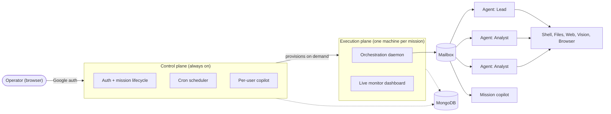

# MAGI V3

MAGI V3 runs teams of AI agents that work autonomously on long-running tasks, coordinating with each other and with a human operator through a persistent mailbox.

The human operator is assisted by "copilot" agents: one at the 'control' level to spin up new teams, and one at each 'mission' level to monitor the performance and fine-tune the configuration of the team.

High level objectives for the team are set by the human operator (with the help of the mission copilot); more granular tasks are also defined for each agent, very much like you would manage people. The copilot guides the agents in reporting progress and KPIs and in allocating their LLM token consumption to tasks and objectives. The copilot also monitors the alignment of the agents with the mission objectives. 

Agents maintain their own 'mental maps' with medium to long term memory; the high-level structure of these mental maps can be enforced, along with detailed instructions.

Agents are given access to a virtual computer to save artefacts or execute programs. All agents in a team share the same file-system, each with its own linux user-name and permissions. The human operator can inspect, edit and download/upload all these files. Agents also have access to the worldwide web with search and interactive browsing abilities.

The abilities of agents are increased through a library of 'skills'. These are written by the human operator, the copilot or the agents themselves on the file system. Each skill describes how to perform a specific task and may also include scripts or programs that can be used.

LLM token consumption is monitored through a number of hard and soft limits.

For security reasons, teams are deployed on virtual machines in the cloud (one machine per team + one machine for the control plane to manage all the missions). Agents do not have access to your personal computer. Agents do not have access to API secrets.

---

## Capabilities

- Agent teams with a role, a supervisor chain, and per-agent tool/skill access. Start one through
  the cockpit (sign in, pick a template, launch) or run purely locally with no cloud machine at
  all — see [Running a mission](#running-a-mission)
- An objectives tree (goals → tasks → KPIs) with automatic cost attribution, reviewed by the
  mission copilot; a control-plane copilot to launch and manage missions
- Shell, file I/O, web fetch/search, image inspection, a headless browser, an isolated `Research`
  sub-loop, background jobs, and a data factory (FRED, FMP, yfinance, NewsAPI, GDELT, IMF, World
  Bank)
- Conversation history and mental maps survive restarts; a mission sleeps between wakeups — woken
  by a database change stream, not polling — and every file an agent writes is committed to git
  automatically, traceable back to the turn and agent that produced it
- Cron-based recurring wakeups; inline images, tables, Mermaid, and KaTeX in agent messages
- Each agent's shell tools run as a dedicated, ACL'd Linux user; web content is treated as
  untrusted by default; a maintained threat model and findings tracker
- An always-on control plane provisions on-demand cloud machines per mission (Fly.io), with
  Google auth and per-user mission scoping
- Every LLM call logged with a full cost breakdown; configurable hard/soft spend limits enforced
  live

---

## Architecture at a glance



Full design: [docs/adr/0013-cloud-execution-architecture.md](docs/adr/0013-cloud-execution-architecture.md).

---

## Status

**MVP complete.** The system runs end-to-end, locally and in the cloud: agent teams coordinate, use tools, persist state across restarts, wake on schedule, and are managed through a multi-tenant cloud control plane with a cockpit UI and a per-user AI copilot. Current work is operational and security hardening ahead of a production launch — see [MAGI_V3_ROADMAP.md](MAGI_V3_ROADMAP.md) for the full sprint history and what's next.

---

## ⚠ Safety warning

This system runs AI agents that execute shell commands, write files, browse the web, and message each other — autonomously, for extended periods, with minimal human supervision.

!!!DO NOT GIVE YOUR AGENTS THE PASSWORDS TO YOUR OWN ACCOUNTS!!! 
You never know what they could do in your name...

!!!THINK THREE TIMES BEFORE GIVING THEM ANY OTHER SENSITIVE INFORMATION, AND THEN DO NOT DO IT ANYWAY!!! 
Your information will be written at external providers (Fly.io, MongoDB Atlas, and of course your LLM providers). The plaform has not undergone any pen-testing.

!!!ALWAYS MAINTAIN HARD TOKEN LIMITS AT YOUR LLM PROVIDERS (and do not use their auto-replensih features)!!! 
MAGI-V3 ships with its own limit system, but better safe than sorry.

- **Agents execute real shell commands.** A confused or manipulated agent can delete files, make network requests, or exhaust disk. Review `permittedPaths` before deploying.
- **Web content is untrusted.** The trust-boundary headers are a mitigation, not a guarantee. Do not point agents at adversarial content and ask them to act on it without human review checkpoints.
- **API costs are real.** Set `MAX_COST_USD` in your environment. A misconfigured cron schedule can accumulate significant spend.
- **The security model has had internal review** (see `docs/security/`) but no independent audit. Browser process isolation is a known gap (Playwright runs in the orchestrator process), documented and deferred.

Use this in a controlled environment. The monitor and control-plane endpoints are authenticated; do not disable that.

---

## Prerequisites

**Required:**

- **Node.js 20+** — `node --version` to check
- **Anthropic API key** — get one at https://console.anthropic.com
- **MongoDB** — local (`mongod`) or a free Atlas cluster at https://www.mongodb.com/atlas. The default URI is `mongodb://localhost:27017`.

**Optional:**

- **Brave Search API key** — enables the `SearchWeb` tool. Free tier (2 000 req/month) at https://brave.com/search/api/
- **Playwright Chromium** — enables the `BrowseWeb` tool for JS-rendered pages
- **Data API keys** (`FRED_API_KEY`, `FMP_API_KEY`, `NEWSAPIORG_API_KEY` in `.env.data-keys`) — enable the data-factory adapters
- **Firebase + Fly.io credentials** — only for the multi-user cloud control plane (see [docs/deployment.md](docs/deployment.md))

**Linux only — OS isolation setup:**

The system runs each agent's shell tools as a dedicated OS user (`magi-w1`, `magi-w2`, …). This
requires the pool users and a sudoers rule. `setup-dev.sh` creates them, sets up the Python venv
used by the data factory, and configures `/etc/sudoers.d/magi`:

```bash
sudo env NODE_BIN=$(which node) scripts/setup-dev.sh
```

(Pass `NODE_BIN` explicitly — a bare `sudo` picks the wrong node under nvm.) This is required for integration tests and the full daemon.

**Install:**

```bash
git clone https://github.com/arnadu/magi_v3 && cd magi_v3
npm install && npm run build

cp .env.example .env
# Edit .env — set ANTHROPIC_API_KEY and MONGODB_URI at minimum

# Optional: headless browser support
cd packages/agent-runtime-worker && npx playwright install chromium && cd ../..
```

## Running a mission

Worker commands live in the `agent-runtime-worker` package — run them with
`-w packages/agent-runtime-worker` from the repo root (or `cd` into the package first).

```bash
# Single-turn CLI:
TEAM_CONFIG=config/teams/test/word-count.yaml \
  npm run cli -w packages/agent-runtime-worker -- "count the words"

# Persistent daemon (waits for messages, runs indefinitely):
TEAM_CONFIG=config/teams/equity-research.yaml npm run daemon -w packages/agent-runtime-worker
# Dashboard: http://localhost:4000 — click ▶ Start

# Post a message to a running daemon:
TEAM_CONFIG=config/teams/equity-research.yaml \
  npm run cli:post -w packages/agent-runtime-worker -- --to lead-analyst "What is NVDA's current recommendation?"

# Watch replies:
TEAM_CONFIG=config/teams/equity-research.yaml npm run cli:tail -w packages/agent-runtime-worker

# LLM usage / cost report:
TEAM_CONFIG=config/teams/equity-research.yaml npm run cli:usage -w packages/agent-runtime-worker
```

## Cloud deployment (Fly.io)

```bash
cp secrets.env.template secrets.env   # fill in ANTHROPIC_API_KEY, MONGODB_URI, CONTROL_API_KEY
bash scripts/bootstrap.sh             # create apps, set secrets, build + deploy
bash scripts/deploy-missions.sh       # deploy the execution-plane image (always use this script)
```

Full guide (app naming, GitHub Actions, auth, operations, cost, troubleshooting): [docs/deployment.md](docs/deployment.md).

## Tests

```bash
npm test                  # unit tests — no LLM, no network
npm run test:integration  # full stack — requires ANTHROPIC_API_KEY + MONGODB_URI (and pool users)
npm run lint
```

---

## Repository layout

```
packages/
  control-plane/          — Express API (missions CRUD + lifecycle), Fly client, cron scheduler, copilot, proxy, UI
  agent-runtime-worker/   — daemon, agent loop, tools, orchestrator, monitor server, tool IPC server, CLI
  agent-config/           — YAML team config loader (Zod schema)
  skills/                 — platform-tier skill playbooks
config/
  teams/                  — team YAML configs (equity-research, gold-digest, general-assistant; test/ for fixtures)
docs/
  adr/                    — architecture decision records
  deployment.md           — cloud deployment guide
  security/               — threat model, findings, security practice
  operational-resilience.md, implementation-history.md
scripts/                  — dev setup, bootstrap, deploy, template seeding
```

---

*Built with [Claude Code](https://claude.ai/code).*
