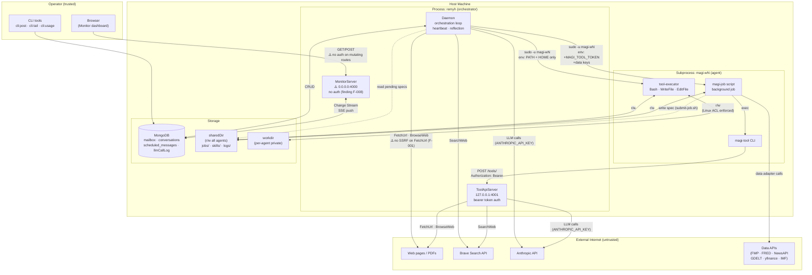

# MAGI V3 Threat Model

**Last updated:** Sprint 12 close-out (2026-04-10)
**Update cadence:** Update whenever a new trust boundary, external service, or privilege level is added.

---

## Actors

| Actor | Trust level | Capabilities |
|-------|-------------|--------------|
| Operator | **Fully trusted** | Posts messages, controls daemon, reads all mission state, runs CLI tools |
| Agent LLM output | **Conditionally trusted** | Calls tools within `AclPolicy`; confined to its `linuxUser` and `permittedPaths` |
| External web content | **Untrusted** | Injected into agent context via FetchUrl / BrowseWeb / SearchWeb / data adapters |
| Background job scripts | **Agent-trust** | Run as the agent's `linuxUser`; call ToolApiServer via short-lived bearer token |
| Other agents in mission | **Agent-trust** | Write to sharedDir; post mailbox messages; write mission skills |

---

## Data Flow Diagram

---

## Trust Boundaries

| Boundary | Crossing mechanism | Direction |
|----------|--------------------|-----------|
| **TB-1** External internet ↔ Daemon | HTTP (FetchUrl, BrowseWeb, APIs) | Inbound: untrusted content; Outbound: requests |
| **TB-2** Operator ↔ MonitorServer | HTTP GET/POST (no auth) | Bidirectional |
| **TB-3** Daemon (remyh) ↔ tool-executor (magi-wN) | `sudo -u magi-wN`, clean env | Outbound: commands; Inbound: stdout/stderr |
| **TB-4** Daemon (remyh) ↔ magi-job (magi-wN) | `sudo -u magi-wN`, +token +data keys | Outbound: script + env; Inbound: exit code |
| **TB-5** magi-job (magi-wN) ↔ ToolApiServer (remyh) | HTTP + bearer token, loopback | Outbound: tool calls; Inbound: results |
| **TB-6** Agent LLM ↔ tool execution | Tool call parsing + AclPolicy | Agent-controlled input to privileged operations |
| **TB-7** Agents ↔ sharedDir | Filesystem (Linux ACLs on workdirs only) | All agents read/write shared surface |
| **TB-8** External content ↔ agent context | FetchUrl/BrowseWeb result injected into LLM messages | Untrusted text into trusted reasoning |

---

## STRIDE Threat Table

Findings reference `docs/security/findings.md` by ID. `✅` = mitigated; `⚠️` = open finding; `~` = partially mitigated; `A` = accepted.

### TB-1: External internet → FetchUrl / BrowseWeb

| Threat | Category | Status | Notes |
|--------|----------|--------|-------|
| SSRF via FetchUrl — fetch internal services | **I / E** | ⚠️ F-001 | No hostname validation in FetchUrl |
| SSRF via BrowseWeb post-navigation redirect | **I / E** | ⚠️ F-002 | Initial check only; Stagehand can navigate further |
| DNS rebinding — IP changes between check and connect | **I** | ~ | Post-redirect check provides partial mitigation; fully solved by F-002 fix |
| Oversized response — OOM crash | **D** | ✅ | 50 MB response cap (S4-M1) |
| Malicious content injected into agent context | **T** | ~ TB-8 | Trust boundary markers on BrowseWeb; FetchUrl lacks them (F-007) |

### TB-2: Operator → MonitorServer

| Threat | Category | Status | Notes |
|--------|----------|--------|-------|
| Unauthenticated POST /stop, /send-message, /extend-budget | **S / E** | ⚠️ F-008 | Binds to 0.0.0.0:4000; no auth on mutating routes |
| SSE stream exposes all mission data on network | **I** | ⚠️ F-009 | Any host reachable on port 4000 sees full agent activity |

### TB-3: Daemon → tool-executor (sudo boundary)

| Threat | Category | Status | Notes |
|--------|----------|--------|-------|
| API key leaks into child process env | **I** | ✅ | S4-H2: clean env (PATH+HOME only); verified by `verifyIsolation()` at startup |
| Agent writes to another agent's workdir via Bash | **T / E** | ✅ | OS Linux ACLs (setfacl); covered by acl.integration.test.ts |
| Shell injection in setfacl call | **E** | ✅ | S4-H1: `execFileSync("setfacl", [...])`, no shell |

### TB-4: Daemon → magi-job (sudo boundary + token injection)

| Threat | Category | Status | Notes |
|--------|----------|--------|-------|
| linuxUser escalation via crafted job spec | **E** | ✅ | A5: linuxUser removed from JobSpec; derived from agentId via team config |
| scriptPath traversal — run script outside permittedPaths | **T / E** | ✅ | A6: scriptPath validated against agent's permittedPaths before spawn |
| MAGI_TOOL_TOKEN exposed in job log | **I** | A | F-005: low severity; token is revoked on job exit |
| No wall-clock timeout — hung job holds concurrency slot | **D** | ⚠️ F-006 | No `JobSpec.timeoutMs`; max 3 concurrent slots can all be blocked |
| Orphaned jobs/running on daemon restart | **D** | ⚠️ F-010 | Jobs in running/ at restart have no token; magi-tool calls fail silently |

### TB-5: magi-job → ToolApiServer (bearer token)

| Threat | Category | Status | Notes |
|--------|----------|--------|-------|
| Token theft — leaked token used by another process | **S** | ~ | Short-lived; bound to AclPolicy; cannot escalate beyond it |
| Token cannot exceed agent's AclPolicy | **E** | ✅ | AclPolicy enforced by ToolApiServer on every call |

### TB-6: Agent LLM → tool execution (AclPolicy boundary)

| Threat | Category | Status | Notes |
|--------|----------|--------|-------|
| Symlink traversal in WriteFile/EditFile | **T / E** | ⚠️ F-003 | `resolve()` normalises `..` but does not follow symlinks |
| file:// LFI via FetchUrl | **I** | ✅ | S4-C1: file:// protocol rejected |
| Bash timeout bypass — pass large timeout value | **D** | ✅ | S4-M3: capped at 600 s |
| Bash background processes escape spawnSync timeout | **D** | ⚠️ F-011 | SIGKILL goes to direct child only; `&` escapes it |
| PostMessage to arbitrary recipient | **T** | ✅ | S4-M2: recipient validated against team roster |

### TB-7: Agents ↔ sharedDir (shared write surface)

| Threat | Category | Status | Notes |
|--------|----------|--------|-------|
| Agent overwrites another agent's sharedDir output | **T** | A | Intentional design (collaboration via shared files) |
| Adversarial SKILL.md in mission/ tier | **T** | ⚠️ F-007 | description injected into all agents' system prompts; no sanitization |
| Agent writes crafted schedule label — NoSQL operator injection | **T** | ⚠️ F-005 | `spec.label` used as MongoDB upsert filter without type validation |

### TB-8: External content → agent context (prompt injection)

| Threat | Category | Status | Notes |
|--------|----------|--------|-------|
| Injected web content overrides agent instructions | **T** | ~ | BrowseWeb has trust boundary markers; FetchUrl lacks them (F-007) |
| Compromised agent writes adversarial HTML to mental map | **T** | ~ | patchMentalMap uses jsdom surgical patching; arbitrary section insertion possible |
| MongoDB `$regex` ReDoS via LLM-generated search string | **D** | ⚠️ F-004 | `opts.search` in ListMessages passed as unescaped regex |
