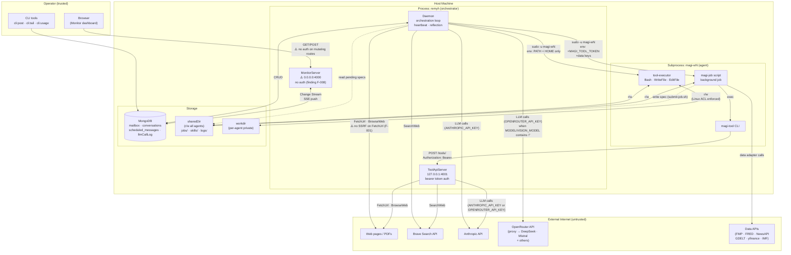

# MAGI V3 Threat Model

**Last updated:** Sprint 13 — OpenRouter integration (2026-04-18)
**Update cadence:** Update whenever a new trust boundary, external service, or privilege level is added.

---

## Actors

| Actor | Trust level | Capabilities |
|-------|-------------|--------------|
| Operator | **Fully trusted** | Posts messages, controls daemon, reads all mission state, runs CLI tools |
| Agent LLM output | **Conditionally trusted** | Calls tools within `AclPolicy`; confined to its `linuxUser` and `permittedPaths` |
| External web content | **Untrusted** | Injected into agent context via FetchUrl / BrowseWeb / SearchWeb / data adapters |
| Background job scripts | **Agent-trust** | Run as the agent's `linuxUser`; call ToolApiServer via short-lived bearer token |
| Other agents in mission | **Agent-trust** | Write to sharedDir; post mailbox messages; write mission skills |

---

## Data Flow Diagram

---

## Trust Boundaries

| Boundary | Crossing mechanism | Direction |
|----------|--------------------|-----------|
| **TB-1** External internet ↔ Daemon | HTTP (FetchUrl, BrowseWeb, APIs, LLM calls) | Inbound: untrusted content; Outbound: requests (including full conversation context to LLM providers) |
| **TB-2** Operator ↔ MonitorServer | HTTP GET/POST (no auth) | Bidirectional |
| **TB-3** Daemon (remyh) ↔ tool-executor (magi-wN) | `sudo -u magi-wN`, clean env | Outbound: commands; Inbound: stdout/stderr |
| **TB-4** Daemon (remyh) ↔ magi-job (magi-wN) | `sudo -u magi-wN`, +token +data keys | Outbound: script + env; Inbound: exit code |
| **TB-5** magi-job (magi-wN) ↔ ToolApiServer (remyh) | HTTP + bearer token, loopback | Outbound: tool calls; Inbound: results |
| **TB-6** Agent LLM ↔ tool execution | Tool call parsing + AclPolicy | Agent-controlled input to privileged operations |
| **TB-7** Agents ↔ sharedDir | Filesystem (Linux ACLs on workdirs only) | All agents read/write shared surface |
| **TB-8** External content ↔ agent context | FetchUrl/BrowseWeb result injected into LLM messages | Untrusted text into trusted reasoning |

---

## Implementing Files by Boundary

This section is the index used by `/security-audit`. For each trust boundary, it lists every
file that implements that crossing. Update this whenever a boundary's implementation changes.

### TB-1: External HTTP requests (FetchUrl, BrowseWeb, data adapters, LLM providers)
- `packages/agent-runtime-worker/src/tools/fetch-url.ts` — HTTP GET, HTML/PDF extraction, image download
- `packages/agent-runtime-worker/src/tools/browse-web.ts` — Playwright/Stagehand, SSRF check (initial nav only)
- `packages/agent-runtime-worker/src/tools/research.ts` — Research sub-loop; calls FetchUrl and SearchWeb
- `packages/agent-runtime-worker/src/tools/search-web.ts` — Brave Search API call
- `packages/agent-runtime-worker/src/models.ts` — `parseModel()`: routes `provider/model` IDs to OpenRouter; bare IDs to Anthropic; both outbound with full conversation context
- `packages/skills/data-factory/scripts/adapters/` — all 7 Python adapters (fmp, fred, yfinance, newsapi, gdelt, imf, worldbank)

### TB-2: Monitor server (operator interface)
- `packages/agent-runtime-worker/src/monitor-server.ts` — HTTP server + SSE; binds `0.0.0.0:4000`; all routes

### TB-3: tool-executor subprocess (Bash, WriteFile, EditFile)
- `packages/agent-runtime-worker/src/tools.ts` — `checkPath()`, `AclPolicy`, `spawnSync`, clean child env, `verifyIsolation()`
- `packages/agent-runtime-worker/src/tool-executor.ts` — clean child entry point; reads stdin, dispatches, writes stdout

### TB-4: magi-job subprocess (background jobs + token injection)
- `packages/agent-runtime-worker/src/daemon.ts` — `runPendingJobs()`: token mint, `sudo` spawn, token revoke, spec validation
- `scripts/setup-dev.sh` — `magi-job` wrapper at `/usr/local/bin/magi-job`, sudoers NOPASSWD + `env_keep` rules

### TB-5: ToolApiServer — magi-job → daemon IPC
- `packages/agent-runtime-worker/src/tool-api-server.ts` — HTTP server `127.0.0.1:4001`; bearer token auth; tool dispatch
- `packages/agent-runtime-worker/src/cli-tool.ts` — `magi-tool` CLI (Node.js client)
- `packages/skills/run-background/scripts/magi_tool.py` — Python SDK client (stdlib only)

### TB-6: AclPolicy enforcement (LLM output → privileged operations)
- `packages/agent-runtime-worker/src/tools.ts` — `checkPath()`, `PolicyViolationError`, Bash/WriteFile/EditFile dispatch
- `packages/agent-runtime-worker/src/agent-runner.ts` — tool registration, `AclPolicy` construction, `researchAcl`
- `packages/agent-runtime-worker/src/loop.ts` — `maxTurns` cap, tool call dispatch

### TB-7: sharedDir shared write surface
- `packages/agent-runtime-worker/src/workspace-manager.ts` — `setfacl` provisioning, dir creation, git init
- `packages/agent-runtime-worker/src/skills.ts` — `discoverSkills()`: SKILL.md frontmatter parsing, scope precedence
- `packages/agent-runtime-worker/src/daemon.ts` — scheduled message upsert (`spec.label` filter), job spec file reads

### TB-8: Untrusted content → agent context (prompt injection)
- `packages/agent-runtime-worker/src/tools/fetch-url.ts` — tool result (markdown) injected into LLM messages
- `packages/agent-runtime-worker/src/tools/browse-web.ts` — trust boundary markers wrapping Stagehand output
- `packages/agent-runtime-worker/src/prompt.ts` — `buildSystemPrompt()`: mental map + skills block → system prompt
- `packages/agent-runtime-worker/src/mental-map.ts` — `patchMentalMap()`: jsdom surgical patching of agent-written HTML
- `packages/agent-runtime-worker/src/reflection.ts` — cumulative summary injected as user message at session start
- `packages/agent-runtime-worker/src/mailbox.ts` — `listMessages` `$regex` search; message bodies formatted as user turns

---

## STRIDE Threat Table

Findings reference `docs/security/findings.md` by ID. `✅` = mitigated; `⚠️` = open finding; `~` = partially mitigated; `A` = accepted.

### TB-1: External internet → FetchUrl / BrowseWeb

| Threat | Category | Status | Notes |
|--------|----------|--------|-------|
| SSRF via FetchUrl — fetch internal services | **I / E** | ⚠️ F-001 | No hostname validation in FetchUrl |
| SSRF via BrowseWeb post-navigation redirect | **I / E** | ⚠️ F-002 | Initial check only; Stagehand can navigate further |
| DNS rebinding — IP changes between check and connect | **I** | ~ | Post-redirect check provides partial mitigation; fully solved by F-002 fix |
| Oversized response — OOM crash | **D** | ✅ | 50 MB response cap (S4-M1) |
| Malicious content injected into agent context | **T** | ~ TB-8 | Trust boundary markers on BrowseWeb; FetchUrl result injected without markers (see TB-8) |
| Conversation data (system prompt, mental map, tool results) sent to OpenRouter third-party proxy | **I** | ~ | OpenRouter has separate data-retention/logging policy from Anthropic; full financial mission context transmitted when OpenRouter models used; OPENROUTER_API_KEY isolated to daemon process (not forwarded to agent subprocesses or background jobs) |
| OPENROUTER_API_KEY leaks into tool-executor child env | **I** | ~ | Mitigated by clean-env spawn (only PATH+HOME); `verifyIsolation()` checks `ANTHROPIC_API_KEY` only — does not check `OPENROUTER_API_KEY`; silent gap in startup invariant |

### TB-2: Operator → MonitorServer

| Threat | Category | Status | Notes |
|--------|----------|--------|-------|
| Unauthenticated POST /stop, /send-message, /extend-budget | **S / E** | ⚠️ F-008 | Binds to 0.0.0.0:4000; no auth on mutating routes |
| SSE stream exposes all mission data on network | **I** | ⚠️ F-009 | Any host reachable on port 4000 sees full agent activity |
| CORS wildcard enables cross-origin control | **S / T** | ⚠️ F-012 | `Access-Control-Allow-Origin: *` on all responses; cross-origin page open in operator's browser can call POST /stop, /send-message, /extend-budget |

### TB-3: Daemon → tool-executor (sudo boundary)

| Threat | Category | Status | Notes |
|--------|----------|--------|-------|
| API key leaks into child process env | **I** | ✅ | S4-H2: clean env (PATH+HOME only); verified by `verifyIsolation()` at startup |
| Agent writes to another agent's workdir via Bash | **T / E** | ✅ | OS Linux ACLs (setfacl); covered by acl.integration.test.ts |
| Shell injection in setfacl call | **E** | ✅ | S4-H1: `execFileSync("setfacl", [...])`, no shell |

### TB-4: Daemon → magi-job (sudo boundary + token injection)

| Threat | Category | Status | Notes |
|--------|----------|--------|-------|
| linuxUser escalation via crafted job spec | **E** | ✅ | A5: linuxUser removed from JobSpec; derived from agentId via team config |
| scriptPath traversal via symlink — run arbitrary executable | **T / E** | ⚠️ F-013 | A6 fix uses `join()` not `realpathSync()`; symlink in sharedDir/jobs/pending/ passes permittedPaths check but OS follows symlink at execution time |
| MAGI_TOOL_TOKEN exposed in job log | **I** | A | A-003: token short-lived (revoked on job exit); logs within sharedDir only |
| MAGI_TOOL_TOKEN orphaned on spawn() failure | **I** | ⚠️ F-014 | Token issued before `spawn()`; only revoked in `close` handler; synchronous throw leaves token live until daemon restart |
| No wall-clock timeout — hung job holds concurrency slot | **D** | ⚠️ F-006 | No `JobSpec.timeoutMs`; max 3 concurrent slots can all be blocked |
| Orphaned jobs/running on daemon restart | **D** | ⚠️ F-010 | Jobs in running/ at restart have no token; magi-tool calls fail silently |

### TB-5: magi-job → ToolApiServer (bearer token)

| Threat | Category | Status | Notes |
|--------|----------|--------|-------|
| Token theft — leaked token used by another process | **S** | ~ | Short-lived; bound to AclPolicy; cannot escalate beyond it |
| Token cannot exceed agent's AclPolicy | **E** | ✅ | AclPolicy enforced by ToolApiServer on every call |
| Client timeout exceeds server timeout — concurrency slot held after 504 | **D** | ⚠️ F-015 | `magi_tool.py` timeout=300 s; server aborts at 120 s; client waits 180 s more, blocking daemon concurrency slot |

### TB-6: Agent LLM → tool execution (AclPolicy boundary)

| Threat | Category | Status | Notes |
|--------|----------|--------|-------|
| Symlink traversal in WriteFile/EditFile | **T / E** | ⚠️ F-003 | `resolve()` normalises `..` but does not follow symlinks |
| file:// LFI via FetchUrl | **I** | ✅ | S4-C1: file:// protocol rejected |
| Bash timeout bypass — pass large timeout value | **D** | ✅ | S4-M3: capped at 600 s |
| Bash background processes escape spawnSync timeout | **D** | ⚠️ F-011 | SIGKILL goes to direct child only; `&` escapes it |
| PostMessage to arbitrary recipient | **T** | ✅ | S4-M2: recipient validated against team roster |

### TB-7: Agents ↔ sharedDir (shared write surface)

| Threat | Category | Status | Notes |
|--------|----------|--------|-------|
| Agent overwrites another agent's sharedDir output | **T** | A | Intentional design (collaboration via shared files) |
| Adversarial SKILL.md in mission/ tier | **T** | ~ | description injected into all agents' system prompts; no sanitization; partially mitigated by symlink exclusion in discoverSkills() |
| Agent writes crafted schedule label — NoSQL operator injection | **T** | ⚠️ F-005 | `spec.label` used as MongoDB upsert filter without type validation |

### TB-8: External content → agent context (prompt injection)

| Threat | Category | Status | Notes |
|--------|----------|--------|-------|
| Injected web content overrides agent instructions | **T** | ~ | BrowseWeb has trust boundary markers; FetchUrl result injected without markers |
| Compromised agent writes adversarial HTML to mental map | **T** | ~ | patchMentalMap uses jsdom surgical patching; arbitrary section insertion possible |
| MongoDB `$regex` ReDoS via LLM-generated search string | **D** | ⚠️ F-004 | `opts.search` in ListMessages passed as unescaped regex |

---

## OWASP LLM Top 10 Threat Table

STRIDE covers infrastructure threats well but has no category for LLM-specific attack vectors.
The [OWASP LLM Top 10](https://owasp.org/www-project-top-10-for-large-language-model-applications/)
fills this gap. Only items directly relevant to MAGI are included.

`✅` = mitigated; `⚠️` = open finding; `~` = partially mitigated; `A` = accepted.

| OWASP ID | Name | MAGI relevance | Implementing files | Status | Notes |
|----------|------|----------------|-------------------|--------|-------|
| **LLM01** | Prompt Injection | Untrusted content (web pages, news articles, mailbox bodies, SKILL.md descriptions) enters the LLM's context and may override agent instructions or cause the agent to take unintended privileged actions | TB-8 files; `skills.ts`; `mailbox.ts` | ~ | BrowseWeb wraps output in trust boundary markers; FetchUrl injects result as plain markdown with no boundary markers. SearchWeb result titles/descriptions also unguarded. No hard technical enforcement — LLM reasoning is the only defence once content is in context. Partially mitigated by role-focused system prompts. |
| **LLM02** | Insecure Output Handling | LLM output directly drives privileged operations: Bash commands, WriteFile paths, JobSpec `scriptPath` fields, schedule labels, PostMessage recipients. A compromised LLM call can write arbitrary files, run arbitrary scripts, or inject messages. | `tools.ts`; `daemon.ts`; `agent-runner.ts` | ~ | AclPolicy (`checkPath`, `permittedPaths`) constrains file operations. `scriptPath` validated against `permittedPaths` (A6 fix). Schedule label type guard open (F-005). PostMessage recipient validated against team roster. Bash commands are unconstrained within the agent's linuxUser — this is intentional (OS ACLs are the backstop). |
| **LLM06** | Sensitive Information Disclosure | Agent system prompt contains: role description, mental map (may include data observations), skills block (file paths). When using OpenRouter models, the full system prompt and conversation (including financial observations in the mental map) are transmitted to a third-party proxy. | `prompt.ts`; `agent-runner.ts`; `mailbox.ts`; `models.ts` | ~ | System prompt does not contain API keys or credentials. Mental map and skills block are mission-internal. PostMessage recipients validated against team roster. **New risk (OpenRouter):** financial mission context sent to third-party proxy with separate data policy when `MODEL` or `VISION_MODEL` contains `/`. |
| **LLM07** | System Prompt Leakage | An injected instruction could ask the agent to repeat its system prompt back in a message, revealing role constraints and mental map contents to an attacker who controls the FetchUrl target or a compromised agent. | `prompt.ts`; `tools/fetch-url.ts`; `mailbox.ts` | ~ | PostMessage recipients restricted to team roster (no external exfiltration path via mailbox). FetchUrl to an attacker-controlled URL could exfiltrate if the agent is tricked into including system prompt content in the URL. No hard mitigation beyond prompt design. |
| **LLM08** | Excessive Agency | Agents have broad capabilities: Bash (arbitrary shell commands as their linuxUser), WriteFile, EditFile, PostMessage, Research, FetchUrl, BrowseWeb, scheduled jobs. An injected instruction can cause an agent to take far wider action than intended — deleting files, spamming agents, submitting background jobs. | `agent-runner.ts`; `tools.ts`; `daemon.ts` | ~ | OS-level ACL limits blast radius to the agent's own workdir + sharedDir. `MAX_COST_USD` cap prevents unbounded spending. No per-turn tool call cap (only `maxTurns` on Research sub-loops). `RESEARCH_MAX_TURNS=10` limits Research sub-loop depth. Background job submission is gated by `runPendingJobs()` validations (agentId, scriptPath) but not by a per-session job count limit. |
| **LLM09** | Overreliance | Agents (especially Alex/Marco/Sam) read data factory outputs (briefs, series CSVs) and act on them without independently verifying freshness or accuracy. Stale or corrupted factory data leads to incorrect recommendations with no error signal. | `data-factory-client/SKILL.md`; `catalog.py` | ~ | `catalog.json` tracks `fetched_at` and `status` (ok/error/stale). Consumer SKILL.md instructs agents to check status before use. No enforcement — agents can ignore stale flags. Fallback rule in SKILL.md: use Research tool if status=error/stale. |
