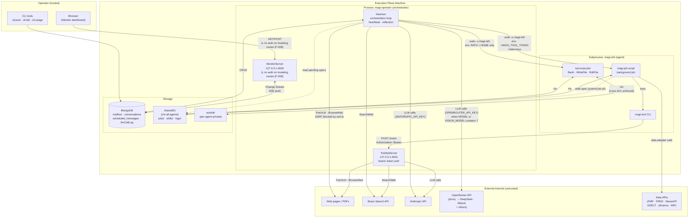
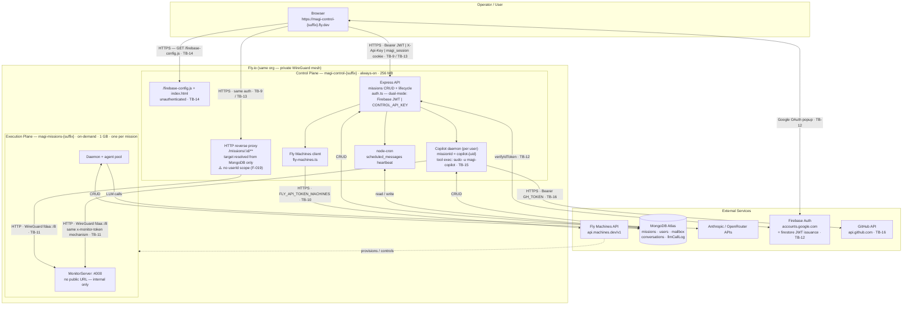

# MAGI V3 Threat Model

**Last updated:** Sprint 26c — Copilot wake-up anomaly log (ADR-0020): no new trust boundary — the
new `missionAnomalies` collection is written by the daemon under the same missionId-scoped access
pattern as `agentTurnStats`/`llmCallLog` (TB-8's implementing files), and the control-plane relay
is a direct MongoDB `mailbox` write from the execution-plane daemon, the same mechanism TB-18
already covers for the mission copilot's own mailbox, just targeting `copilot-{userId}` instead of
the mission's own id. What changed is a **security-relevant correction**, not a new boundary:
removed a `COPILOT_MISSION_ID` env-var-gated relay (TB-18/TB-19 area) that was never actually set
on execution-plane machines in production (confirmed via `fly-machines.ts`'s env-injection block)
and, had it ever been set, would have routed every mission's alerts into one global `"copilot"`
mailbox shared across all users — a cross-user information leak under the Sprint 23 multi-user
model. Replaced with per-mission routing that reads the mission's own `userId` directly and
targets `copilot-{userId}`, matching how every other per-user copilot boundary in this document is
already scoped. See F-028 (found-and-fixed) (2026-07-22)
**Previously:** Sprint 26b — Cost-tracking/limit-config single-source-of-truth rewrite (ADR-0017/0018) + objectives resume-overwrite incident fix: no new trust boundary, but `/set-budget` (TB-2/TB-11) now durably persists to MongoDB instead of only mutating in-memory state — F-025 updated to reflect this; `missions.ts`'s `writeMissionCap` added as a 5th caller of TB-11's direct-monitor-call pattern (previously undocumented, pre-existing since the Limits panel sprint); new TB-7 STRIDE row for the objectives incident (stale MongoDB snapshot overwriting evolved on-volume state on resume — ADR-0019 tracks the full fix) (2026-07-21)
**Earlier:** Sprint 26b — Limits panel: two new mutating routes under existing TB-9 (`PATCH /api/missions/:id/limits/mission`, `PATCH /api/missions/:id/limits/agent/:agentId`) — same `userFilter` scoping as every other `missions.ts` route, no new trust boundary; validated via `LimitsSchema` + `parseTeamConfig` double-validation (2026-07-20)
**Earlier:** Sprint 26 — ADR-0016 mission-copilot architecture: TB-17/18/19 added (mission-copilot tool-executor sudo boundary; mission-copilot → own MonitorServer, amplifies TB-8; execution plane → control-plane GitHub proxy); F-023 (mission-copilot GitHub write has no confirmation gate), F-024 (ListSchedule missing userId scope), F-025 (mission copilot can raise its own spend cap unconfirmed), F-026 (Family D/E tools other than SaveMissionConfig have no resume-delay grace period) opened (2026-07-14)
**Update cadence:** Update whenever a new trust boundary, external service, or privilege level is added.

---

## Actors

| Actor | Trust level | Capabilities |
|-------|-------------|--------------|
| Admin operator (`CONTROL_API_KEY`) | **Fully trusted** | Posts messages, controls daemon, reads all missions; `req.isAdmin = true` |
| Authenticated user (Firebase JWT) | **User-trusted** | Creates and manages own missions; scoped to `userId = Firebase UID`; cannot see other users' missions via CRUD routes |
| Agent LLM output | **Conditionally trusted** | Calls tools within `AclPolicy`; confined to its `linuxUser` and `permittedPaths` |
| External web content | **Untrusted** | Injected into agent context via FetchUrl / BrowseWeb / SearchWeb / data adapters |
| Background job scripts | **Agent-trust** | Run as the agent's `linuxUser`; call ToolApiServer via short-lived bearer token |
| Other agents in mission | **Agent-trust** | Write to sharedDir; post mailbox messages; write mission skills |
| Fly.io Machines API | **External service** | Creates, starts, stops, destroys execution plane machines; does not access MongoDB or agent data |
| Firebase Auth service | **External identity provider** | Issues and validates Google OAuth JWTs; controls token lifetime (~1 h); MAGI V3 reuses existing V2 Firebase projects |
| Mission copilot agent (`agent.id = "mission-copilot"`) | **Agent-trust, elevated within its own mission only** | A normal execution-plane agent, daemon-injected into every mission (ADR-0016); structurally scoped to its own mission (no tool takes a `missionId` parameter — closure-supplied only), but within that mission reads every teammate's mailbox/mental-map/transcripts and can write into a teammate's mental map and the whole mission's config — a larger blast radius than any other agent (amplifies TB-8, see TB-18). Cannot see or reach any other mission. Not `"copilot"`: that id collides with the cockpit frontend's pre-existing hardcoded pseudo-agent for the cross-mission control-plane copilot (`packages/cockpit/src/data.ts`'s `COPILOT_ID`) — found live shortly after rollout and fixed by renaming this agent's id. |
| GitHub API (`api.github.com`) | **External service** | Copilot creates/closes issues and adds comments in the project repo using a `repo`-scoped `GH_TOKEN`; requests are hardcoded to the issues/comments endpoints of one fixed repo (`GITHUB_REPO`), never agent-influenced |
| Copilot agent (`linuxUser: magi-copilot`) | **Agent-trust, control-plane-hosted** | Runs the same `AclPolicy`/tool-executor code path as mission agents (TB-3/TB-6), but on the control-plane host under its own OS user; additionally has Category B "elevated" tools (Mongo + Fly API + GitHub — see TB-16) not available to mission agents |

---

## Data Flow Diagrams

### Execution Plane — Internal Architecture

### Cloud Deployment — Control Plane + Execution Plane

---

## Trust Boundaries

| Boundary | Crossing mechanism | Direction |
|----------|--------------------|-----------|
| **TB-1** | External internet ↔ Daemon | HTTP (FetchUrl, BrowseWeb, APIs, LLM calls) | Inbound: untrusted content; Outbound: requests including full conversation context to LLM providers |
| **TB-2** | Operator ↔ MonitorServer (local dev) | HTTP GET/POST on localhost:4000; `MONITOR_TOKEN` env var absent in dev → no auth check on mutating routes | Bidirectional |
| **TB-3** | Daemon (magi-operator) ↔ tool-executor (magi-wN) | `sudo -u magi-wN`, clean env | Outbound: commands; Inbound: stdout/stderr |
| **TB-4** | Daemon ↔ magi-job (magi-wN) | `sudo -u magi-wN`, +token +data keys | Outbound: script + env; Inbound: exit code |
| **TB-5** | magi-job (magi-wN) ↔ ToolApiServer (magi-operator) | HTTP + bearer token, loopback | Outbound: tool calls; Inbound: results |
| **TB-6** | Agent LLM ↔ tool execution | Tool call parsing + AclPolicy | Agent-controlled input to privileged operations |
| **TB-7** | Agents ↔ sharedDir | Filesystem (Linux ACLs on workdirs; sharedDir open to all agents) | All agents read/write shared surface |
| **TB-8** | External content ↔ agent context | FetchUrl/BrowseWeb result injected into LLM messages | Untrusted text into trusted reasoning |
| **TB-9** | Browser → Control plane HTTPS | HTTPS to `magi-control-{suffix}.fly.dev`; dual-mode auth: `Authorization: Bearer <Firebase JWT>` (preferred), `X-Api-Key: <CONTROL_API_KEY>` (admin/CI), `Cookie: magi_session=<token>` (cross-tab), `?token=<token>` (SSE `EventSource`) | Bidirectional (REST API + SSE proxy) |
| **TB-10** | Control plane → Fly Machines API | HTTPS to `api.machines.dev/v1`; `FLY_API_TOKEN_MACHINES` bearer token | Outbound: machine lifecycle commands; Inbound: machine state |
| **TB-11** | Control plane proxy → Execution plane | HTTP over Fly WireGuard (`fdaa::/8`); proxy injects `x-monitor-token` header (HMAC-derived, unique per mission); MonitorServer checks token on all mutating routes | Bidirectional (proxy + SSE stream) |
| **TB-12** | Browser ↔ Firebase Auth (Google OAuth) | Browser opens Google OAuth popup; Firebase client SDK receives JWT; control plane calls `getAuth().verifyIdToken()` over HTTPS to Firebase Admin API | Outbound: auth request; Inbound: signed JWT; server calls Firebase to verify |
| **TB-13** | `magi_session` cookie → Control plane | Client-accessible cookie set by browser JS on sign-in; `SameSite=Strict`, `max-age=3600`, `path=/`; carries Firebase JWT or `CONTROL_API_KEY`; no `Secure` flag (Fly.io enforces HTTPS at load balancer) | Browser → server on every same-origin request |
| **TB-14** | `/firebase-config.js` unauthenticated endpoint | Express `GET /firebase-config.js` serves `FIREBASE_CLIENT_API_KEY`, `FIREBASE_CLIENT_AUTH_DOMAIN`, `FIREBASE_CLIENT_PROJECT_ID` from env as a JS snippet; no auth; `Cache-Control: no-store` | Server → browser; public (client-side Firebase identifiers, not secrets) |
| **TB-15** | Control plane (magi-operator) ↔ copilot tool-executor (magi-copilot) | Same mechanism as TB-3, on the control-plane host instead of the execution plane: `sudo -u magi-copilot` via the `magi-node` wrapper, sudoers `NOPASSWD` rule scoped to that exact binary; copilot's `AgentRunContext` uses `linuxUser: "magi-copilot"` and runs the identical `tools.ts`/`tool-executor.ts` code path as mission agents | Outbound: commands; Inbound: stdout/stderr |
| **TB-16** | Copilot (control plane) → GitHub API | HTTPS to `api.github.com`; `Authorization: Bearer <GH_TOKEN>` (`repo`-scoped PAT, control-plane-only Fly secret); request paths are hardcoded (`/repos/{GITHUB_REPO}/issues...`), only the JSON body (title/body/labels/comment text) is LLM-generated | Outbound: issue create/close/comment; Inbound: issue metadata |
| **TB-17** | Daemon (magi-operator) ↔ mission-copilot tool-executor (own per-agent `linuxUser`) | Same mechanism as TB-3, on the execution plane: `sudo -u <copilot's own linuxUser>`, clean env; the mission copilot gets a real per-agent OS user and workspace ACL through the exact same provisioning path (`ensureAgentUsers`) as any other teammate — narrower than TB-15's shared `magi-copilot` identity, which is one identity shared by every user's control-plane copilot | Outbound: commands; Inbound: stdout/stderr |
| **TB-18** | Mission copilot → own mission's MonitorServer (loopback) | HTTP to `127.0.0.1:{monitorPort}`; reuses the machine's existing `MONITOR_TOKEN` (no new secret) for mutating routes; GET routes exempt (`tokenOk()` fails open when unset, dev-mode only). **Amplifies TB-8** (prompt injection): unlike any other agent, the mission copilot reads every teammate's mailbox/mental-map/transcripts/files and can write into a teammate's mental map and the whole mission's config, so a successful injection against it has a larger blast radius than against any other agent | Bidirectional: elevated diagnostic reads + mutating writes (Families A/C/D/E/F) |
| **TB-19** | Execution plane → control-plane GitHub proxy (`/api/mission-copilot`) | HTTPS; **new direction** — first inbound-from-execution-plane surface on the control plane. HMAC-verified: re-derives `deriveMonitorToken(missionId)` from the request body/query and compares to the `x-monitor-token` header (reuses TB-11's derive-and-compare mechanism, in reverse); fails **closed** on a missing/empty `MONITOR_SIGNING_KEY` (deliberate divergence from `tokenOk()`'s fail-open dev-mode behavior — this endpoint is public HTTPS, not loopback-only); rate-limited 20/min, default per-IP keying (naturally isolates per mission since each runs on its own stable WireGuard address) | Outbound: `ReportGithubIssue`/`ListGithubIssues` requests; Inbound: issue metadata; `GH_TOKEN` never leaves the control plane |

---

## Implementing Files by Boundary

### TB-1: External HTTP requests (FetchUrl, BrowseWeb, data adapters, LLM providers)
- `packages/agent-runtime-worker/src/tools/fetch-url.ts` — HTTP GET, HTML/PDF extraction, image download
- `packages/agent-runtime-worker/src/tools/browse-web.ts` — Playwright/Stagehand, SSRF check (initial nav only)
- `packages/agent-runtime-worker/src/tools/research.ts` — Research sub-loop; calls FetchUrl and SearchWeb
- `packages/agent-runtime-worker/src/tools/search-web.ts` — Brave Search API call
- `packages/agent-runtime-worker/src/ssrf.ts` — `isPrivateHost()` regex + post-DNS-resolution check
- `packages/agent-runtime-worker/src/models.ts` — `parseModel()`: routes `/`-delimited IDs to OpenRouter; bare IDs to Anthropic
- `packages/agent-runtime-worker/src/openrouter-pricing.ts` — unauthenticated `GET https://openrouter.ai/api/v1/models` (Sprint 24, live cost pricing); no request body, no secrets sent; process-lifetime cache, single-flight
- `packages/skills/data-factory/scripts/adapters/` — all 7 Python adapters (fmp, fred, yfinance, newsapi, gdelt, imf, worldbank)

### TB-2: MonitorServer (local dev — operator interface)
- `packages/agent-runtime-worker/src/monitor-server.ts` — HTTP server + SSE; binds `127.0.0.1:4000`; mutating routes lack auth; `GET /log` returns daemon log file tail

### TB-3: tool-executor subprocess (Bash, WriteFile, EditFile)
- `packages/agent-runtime-worker/src/tools.ts` — `checkPath()`, `AclPolicy`, `spawnSync`, clean child env, `verifyIsolation()`
- `packages/agent-runtime-worker/src/tool-executor.ts` — clean child entry point; reads stdin, dispatches, writes stdout

### TB-4: magi-job subprocess (background jobs + token injection)
- `packages/agent-runtime-worker/src/daemon.ts` — `runPendingJobs()`: token mint, `sudo` spawn, token revoke, spec validation
- `packages/agent-runtime-worker/src/job-recovery.ts` — `recoverOrphanedJobs()`: startup sweep of `jobs/running/` (extracted from `daemon.ts` for testability, Sprint 26); `MAX_JOB_RECOVERY_ATTEMPTS` circuit breaker
- `scripts/setup-dev.sh` — `magi-job` wrapper at `/usr/local/bin/magi-job`, sudoers NOPASSWD + `env_keep` rules

### TB-5: ToolApiServer — magi-job → daemon IPC
- `packages/agent-runtime-worker/src/tool-api-server.ts` — HTTP server `127.0.0.1:4001`; bearer token auth; tool dispatch
- `packages/agent-runtime-worker/src/cli-tool.ts` — `magi-tool` CLI (Node.js client)
- `packages/skills/run-background/scripts/magi_tool.py` — Python SDK client (stdlib only)

### TB-6: AclPolicy enforcement (LLM output → privileged operations)
- `packages/agent-runtime-worker/src/tools.ts` — `checkPath()`, `PolicyViolationError`, Bash/WriteFile/EditFile dispatch
- `packages/agent-runtime-worker/src/agent-runner.ts` — tool registration, `AclPolicy` construction, `researchAcl`
- `packages/agent-runtime-worker/src/loop.ts` — `maxTurns` cap, tool call dispatch
- `packages/agent-runtime-worker/src/orchestrator.ts` — `isAgentPaused?(agentId)` hook: future Copilot authority surface for pausing agents; currently no-op in production; Sprint 18 will wire the Copilot to this callback — the daemon must validate that pause requests originate from the Copilot agent only

### TB-7: sharedDir shared write surface
- `packages/agent-runtime-worker/src/workspace-manager.ts` — `setfacl` provisioning, dir creation, git init
- `packages/agent-runtime-worker/src/workspace-git.ts` — `WorkspaceGit`: git-commit-on-sleep (Sprint 25); runs as the mission's git identity, no `sudo` (already within the trusted daemon/sharedDir boundary); serializes all commits through one promise chain
- `packages/agent-runtime-worker/src/skills.ts` — `discoverSkills()`: SKILL.md frontmatter parsing, scope precedence
- `packages/agent-runtime-worker/src/daemon.ts` — scheduled message upsert (`spec.label` filter), job spec file reads
- `packages/agent-runtime-worker/src/objectives/store.ts` — append-only fold of `sharedDir/objectives/*.jsonl` + `goals.json` (Sprint 26a); agent-writable via the `objectives` skill scripts below, same shared-write posture as any other sharedDir content
- `packages/skills/objectives/scripts/` — `task-add`/`task-update`/`record-kpi`/`allocate` (append-only writes only; agent's own `linuxUser`, no elevated privilege)

### TB-8: Untrusted content → agent context (prompt injection)
- `packages/agent-runtime-worker/src/tools/fetch-url.ts` — tool result (markdown) injected into LLM messages
- `packages/agent-runtime-worker/src/tools/browse-web.ts` — trust boundary markers wrapping Stagehand output
- `packages/agent-runtime-worker/src/prompt.ts` — `buildSystemPrompt()`: mental map + skills block → system prompt
- `packages/agent-runtime-worker/src/mental-map.ts` — `patchMentalMap()`: jsdom surgical patching of agent-written HTML
- `packages/agent-runtime-worker/src/reflection.ts` — cumulative summary injected as user message at session start
- `packages/agent-runtime-worker/src/mailbox.ts` — `listMessages` `$regex` search; message bodies formatted as user turns

### TB-9: Browser → Control plane HTTPS (dual-mode auth)
- `packages/control-plane/src/auth.ts` — `createAuthMiddleware(db)`: extracts credential from Bearer header / `X-Api-Key` / `magi_session` cookie / `?token=` query param; validates `CONTROL_API_KEY` first, then Firebase JWT via `verifyFirebaseToken`; sets `req.userId` and `req.isAdmin`
- `packages/control-plane/src/firebase.ts` — `initFirebase()`: Firebase Admin SDK init from `FIREBASE_SERVICE_ACCOUNT_KEY` (preferred) or `applicationDefault()` + `FIREBASE_PROJECT_ID`; `verifyFirebaseToken()`: calls `getAuth().verifyIdToken()`
- `packages/control-plane/src/users.ts` — `syncFirebaseUser()`: upserts `uid`, `email`, `displayName`, `lastLoginAt` into `users` collection on every authenticated request; `uid` is never derived from request body
- `packages/control-plane/src/missions.ts` — `userFilter(req)`: admin sees all (`{}`); regular user sees only `{ userId: req.userId }`; applied to all CRUD + lifecycle queries
- `packages/control-plane/src/index.ts` — Express app assembly; `requireAuth` applied globally after static files and `/firebase-config.js`; rate limit (30 req/60 s) on `/api/copilot`

### TB-12: Browser ↔ Firebase Auth (Google OAuth)
- `packages/control-plane/src/firebase.ts` — server-side token verification via Firebase Admin SDK
- `packages/control-plane/public/index.html` — client-side: `firebase.initializeApp(window.FIREBASE_CONFIG)`; `signInWithPopup(GoogleAuthProvider)`; `onIdTokenChanged` hook updates `magi_session` cookie on token refresh

### TB-13: `magi_session` cookie
- `packages/control-plane/public/index.html` — `setSessionCookie(token)` sets `magi_session=<encoded-token>; path=/; SameSite=Strict; max-age=3600`; `clearSessionCookie()` on sign-out; cookie updated on every `onIdTokenChanged` event
- `packages/control-plane/src/auth.ts` — `extractCookie()`: parses cookie header, `decodeURIComponent`s the JWT value; cookie value fed into same auth pipeline as Bearer token

### TB-14: `/firebase-config.js` unauthenticated endpoint
- `packages/control-plane/src/index.ts` — `GET /firebase-config.js`: serves `FIREBASE_CLIENT_API_KEY`, `FIREBASE_CLIENT_AUTH_DOMAIN`, `FIREBASE_CLIENT_PROJECT_ID` as `window.FIREBASE_CONFIG`; registered before `requireAuth` middleware; `Cache-Control: no-store`

### TB-10: Control plane → Fly Machines API
- `packages/control-plane/src/fly-machines.ts` — Machines API client; reads `FLY_API_TOKEN_MACHINES` and `FLY_MISSIONS_APP_NAME` from env only; never user-supplied
- `packages/control-plane/src/scheduler.ts` — node-cron heartbeat; calls `resumeMission()` before delivering scheduled messages

### TB-11: Control plane proxy → Execution plane
- `packages/control-plane/src/proxy.ts` — resolves `privateIp` from MongoDB `missions` collection by `{ missionId, userId }` (F-019 fixed); validates machine state; re-derives `MONITOR_TOKEN = HMAC-SHA256(MONITOR_SIGNING_KEY, missionId)` and injects as `x-monitor-token` header
- `packages/control-plane/src/monitor-token.ts` — `deriveMonitorToken(missionId)`: HMAC-SHA256 using `MONITOR_SIGNING_KEY` (control-plane-only Fly secret); returns empty string when key is absent (local dev)
- `packages/agent-runtime-worker/src/monitor-server.ts` — reads `MONITOR_TOKEN` env var (set at provision); `tokenOk()` checks `x-monitor-token` header on all non-GET requests; skips check when env var absent (dev mode)
- `packages/control-plane/src/fly-machines.ts` — derives and injects `MONITOR_TOKEN` into machine env at provision time; `MONITOR_SIGNING_KEY` never leaves the control plane
- `packages/control-plane/src/copilot-router.ts` — a second caller of this same boundary: `executeAction`'s `write_mission_file`/`save_template` handlers call the mission's MonitorServer directly (`http://[privateIp]:4000${endpoint}`) rather than through the browser-facing proxy, using the same `deriveMonitorToken` + `x-monitor-token` mechanism, scoped by `{ missionId, userId }` on the preceding `missions.findOne`
- `packages/control-plane/src/copilot-tools.ts` — `monitorFetch`/`monitorPost` helpers: same direct-call pattern, used by `GetMissionStatus`/`ReadMissionMailbox`/`ReadMissionLog`/`ReadMissionFile`/`ReviewObjectives`/`AssessKpi`; every caller resolves `privateIp` from a `{ missionId, userId }`-scoped `missions.findOne` first
- `packages/control-plane/src/missions.ts` — `GET /:id/agents` (fourth caller): fetches the mission's own `GET /team` route to get the *live* daemon roster rather than the stored `teamConfigYaml`, since the mission copilot (ADR-0016) is injected in-memory only and would otherwise never appear in the cockpit's Conversations panel. GET-only (monitor's `tokenOk()` exempts GET), scoped by the preceding `{ missionId, ...userFilter(req) }` lookup; falls back to the static YAML parse on any fetch failure (mission suspended, still booting, network hiccup) rather than 500ing
- `packages/control-plane/src/missions.ts` — `writeMissionCap` (fifth caller, pre-existing since the Limits panel sprint but not previously listed here): best-effort `POST /set-budget` immediately after persisting the new cap to MongoDB, so a currently-paused mission wakes without waiting for its own next check; scoped by the same preceding `{ missionId, ...userFilter(req) }` lookup as every other caller. Failure is silently tolerated (`liveUpdateApplied: false` in the response) — the Mongo write is the source of truth regardless (ADR-0018)

### MongoDB `users` collection (new Sprint 23 surface)
- `packages/control-plane/src/users.ts` — `syncFirebaseUser()` upserts on every authenticated request; stores `uid` (Firebase UID, used as `userId` throughout), `email`, `displayName`, `createdAt`, `lastLoginAt`; no secrets stored; `uid` is never derived from request body
- `packages/control-plane/src/copilot-router.ts` — `missionId = copilot-{userId}` provides per-user daemon namespace; `CopilotEventBus` segregates SSE streams by `userId`

### Per-user copilot daemons (`copilot-{uid}`)
- `packages/control-plane/src/copilot-router.ts` — `ensureCopilotRunning(userId)` lazily starts one daemon per authenticated user keyed by Firebase UID; `missionId = copilot-{userId}` isolates mailbox and conversation namespaces; SSE events routed per `userId` via `CopilotEventBus`
- `packages/control-plane/src/copilot-tools.ts` — `PendingAction.userId` stamps the owning user on every proposed action; `confirm` and `dismiss` verify `action.userId === req.userId` before executing (F-020 fixed)

### TB-15: Control plane ↔ copilot tool-executor (magi-copilot)
- `packages/control-plane/src/copilot-daemon.ts` — `COPILOT_IDENTITY` sets `linuxUser: "magi-copilot"`, `workdir: COPILOT_WORKDIR`; reuses `runInnerLoop`/`tools.ts` unchanged from the mission-agent path; `execFileSync("setfacl", ...)` grants `magi-copilot` rwx on its own workdir at startup (same ACL-provisioning pattern as `workspace-manager.ts`, not a new mechanism)
- `packages/control-plane/Dockerfile` — creates the `magi-copilot` OS user (uid 60010, group `magi-shared`) and the sudoers rule `magi-operator ALL=(magi-copilot) NOPASSWD: /usr/local/bin/magi-node`, scoped to the exact wrapper binary (mirrors the execution-plane pattern in `scripts/setup-dev.sh`)

### TB-16: Copilot → GitHub API
- `packages/control-plane/src/copilot-tools.ts` — `ghFetch()`: reads `GH_TOKEN`/`GITHUB_REPO` from env only (never request-supplied); `ListIssues` (read-only), `CreateIssue`/`CloseIssue`/`AddIssueComment` (write) — see F-021: unlike `PauseAgent`/`ResumeAgent`/`SetMissionBudget`/`write_mission_file`/`save_template`, these write tools call GitHub directly from `execute()` with no `ProposeAction` operator-confirmation step

### TB-17: Daemon ↔ mission-copilot tool-executor
- `packages/agent-runtime-worker/src/mission-copilot.ts` — `buildMissionCopilotAgentConfig()`: no `linuxUser` override, falls back to the same per-agent OS user derivation (`ensureAgentUsers`) as any other teammate; `injectMissionCopilot()` appends to `teamConfig.agents` in-memory only, never `unshift`s (orchestrator's "lead agent" convention preserved)
- `packages/agent-config/src/loader.ts` — reserved-id check: rejects any authored agent with `id === "mission-copilot"`, so no authored YAML can collide with or spoof the injected agent (`"copilot"` itself is unrestricted — that id belongs to the control-plane copilot's own bootstrap config, `config/teams/copilot.yaml`)
- `packages/agent-runtime-worker/src/tools.ts` / `tool-executor.ts` — identical code path as TB-3, no new mechanism

### TB-18: Mission copilot → own mission's MonitorServer
- `packages/agent-runtime-worker/src/mission-copilot-tools.ts` — `createMissionCopilotTools({db, missionId, mailboxRepo, monitorPort, monitorToken, controlPlaneUrl})`; every tool takes **zero mission-identifying parameters** in its LLM-facing schema — `missionId` is always closure-supplied; GET calls hit `127.0.0.1:{monitorPort}` unauthenticated (dev-mode fail-open, matches TB-2), mutating calls send `x-monitor-token`
- `packages/agent-runtime-worker/src/supervisor-note.ts` — `EditAgentMentalMap` does **not** write through a monitor route or patch stored conversation history directly (a design change from the original plan, made to avoid polluting the target agent's own LLM conversation history — the mental map is a per-turn HTML snapshot embedded in `conversationMessages`, not something safe to patch out of band). Instead it's file-based under `sharedDir/supervisor-notes/<agentId>.json`, lazily rendered into a `#supervisor-note` region at the start of the target agent's next turn — the same lazy-render-at-turn-start pattern `#my-objectives` already uses. `mission-copilot-tools.ts` validates `agentId` against the mission's current team roster (`teamAgentIds`) before writing — the tool call itself is the existence check, not a separate monitor route
- **Mitigation 1 (amplified-TB-8 marking):** every read tool returning free text a teammate could have authored or passed through is wrapped in the same trust-boundary markers `browse-web.ts` uses for untrusted external content — `ReadAgentMentalMap`, `ReadAgentSessionDetail`, `ReadAgentLlmCall`, `ReadMissionMailboxAll`, `SearchMissionHistory`, `ReadSharedFile`, `ReadAgentWorkdirFile`, and `ReadMissionConfig`'s `teamFiles[].contentPreview`
- **Mitigation 2 (mandatory audit trail):** every Family A/D/E mutating tool posts a same-turn message to the user's mailbox; only `SaveMissionConfig` also has a resume-delay grace period. Residual risk after both mitigations: F-023 (GitHub write, no confirmation gate), F-025 (self-referential spend-cap raise), F-026 (every other Family D/E tool has no confirmation gate or grace period, only the audit post)
- `packages/agent-runtime-worker/src/context-utils.ts` — `EPHEMERAL_TOOLS` extended with `ReadAgentSessionDetail`, `ReadAgentLlmCall`, `ReadMissionMailboxAll`, `SearchMissionHistory`, `ReadSharedFile`, `ReadAgentWorkdirFile`, `ReadMissionLog` so mid-session pruning covers this agent's large-result tools, not just the pre-existing allowlist

### TB-19: Execution plane → control-plane GitHub proxy
- `packages/control-plane/src/mission-copilot-router.ts` — `verifyMissionToken()`: re-derives `deriveMonitorToken(missionId)` from the request body/query and compares to `x-monitor-token`; **fails closed** on a missing/empty `MONITOR_SIGNING_KEY` (explicit divergence from `monitor-server.ts`'s `tokenOk()`, which fails open — correct for that loopback-only boundary, wrong for this public-HTTPS one); `POST /github/issue` forces the `mission-copilot` label and appends a server-side (not tool-side) provenance footer naming the mission, so neither can be stripped or spoofed by the tool call
- `packages/control-plane/src/github.ts` — `ghFetch`/`GITHUB_REPO`/`GH_TOKEN`, extracted from `copilot-tools.ts` and shared by both TB-16 and this boundary; `GH_TOKEN` never leaves the control plane
- `packages/control-plane/src/index.ts` — `/api/mission-copilot` mounted **before** `app.use(requireAuth)` (machine-to-machine auth via monitor token, not browser/Firebase); `express.json({limit:"1mb"})` + `rateLimit({windowMs:60_000, max:20})`, default per-IP keying
- `packages/control-plane/src/fly-machines.ts` — injects `CONTROL_PLANE_URL` into the execution-plane machine env at provision time (`https://${FLY_APP_NAME}.fly.dev`, Fly-provided)
- `packages/agent-runtime-worker/src/mission-copilot-tools.ts` — `ListGithubIssues`/`ReportGithubIssue` (Family G): `missionId` sent in the request body is closure-supplied, never an LLM-facing parameter — the token, not the field, is what's unforgeable; a lied-about `missionId` still 401s because the token was derived from the machine's real one

---

## STRIDE Threat Table

`✅` = mitigated; `⚠️` = open finding (see `findings.md`); `~` = partially mitigated; `A` = accepted.

### TB-1: External internet → FetchUrl / BrowseWeb

| Threat | Category | Status | Notes |
|--------|----------|--------|-------|
| SSRF via FetchUrl — fetch internal RFC-1918 or cloud-metadata services | I / E | ✅ F-001 | Fixed Sprint 13: `ssrf.ts` `isPrivateHost()` validates hostname + post-DNS-resolution IP |
| SSRF via BrowseWeb post-navigation redirect | I / E | ✅ F-002 | Fixed Sprint 16: `page.route("**/*", handler)` intercepts document/xhr/fetch requests during `agent().execute()`; known gap: new tab/popup pages do not inherit handler |
| DNS rebinding — IP changes between check and connect | I | ~ | Post-redirect check in `fetch-url.ts` partially mitigates; fully resolved when F-002 is fixed |
| Oversized response — OOM crash | D | ✅ | 50 MB response cap; Content-Length checked before read |
| Malicious content injected into agent context | T | ~ | Trust boundary markers on BrowseWeb; FetchUrl result injected as plain markdown (see TB-8) |
| Full conversation context sent to OpenRouter third-party proxy | I | ~ | OpenRouter has separate data-retention policy; `OPENROUTER_API_KEY` is daemon-only, never forwarded to subprocesses |
| `OPENROUTER_API_KEY` leaked into tool-executor child env | I | ✅ F-017 | Clean-env spawn is the primary control; `verifyIsolation()` now checks both `ANTHROPIC_API_KEY` and `OPENROUTER_API_KEY` |
| Fly.io WireGuard range (`fdaa::/8`) reachable via FetchUrl/BrowseWeb from execution plane | I / E | ~ | `ssrf.ts` blocks ULA prefix `fd[0-9a-f]{2}:` which covers `fdaa::`; verify after any `ssrf.ts` change |
| OpenRouter pricing fetch (`openrouter-pricing.ts`) is not SSRF-relevant (fixed public URL, no agent input) but still an outbound daemon call | I | ✅ | No request body, no auth header, no secrets in the request; response only affects internal cost display, never executed or interpreted as instructions |

### TB-2: Operator → MonitorServer (local dev)

| Threat | Category | Status | Notes |
|--------|----------|--------|-------|
| Unauthenticated `POST /stop`, `/send-message`, `/extend-budget`, `/set-budget`, `/pause-agent`, `/resume-agent`, `/upload`, `/objectives/kpi` | S / E | ⚠️ F-008 | Binds to `127.0.0.1:4000` (localhost only); no auth on mutating routes in dev. In production all are token-checked via `tokenOk()` (TB-11) and reached only through the `{missionId, userId}`-scoped control-plane proxy. `/upload` writes operator files into `sharedDir` (path-sanitised via `basename`) and processes them with the document processor. `/objectives/kpi` appends a Zod-validated KPI value event to `sharedDir/objectives/kpis.jsonl` (no path input; body is `{kpi, value, by?, note?}`) — used by the copilot's `AssessKpi` tool |
| `GET /download?path=` streams files / a folder zip from `sharedDir`; `GET /objectives` returns the folded objectives store | I | ~ | `/download` path resolved + checked within `sharedDir` (no traversal — `400` otherwise). `/objectives` reads only `sharedDir/objectives/*` (fixed paths, no input) and returns JSON; a malformed store line is skipped, not fatal. Same posture as `GET /files/shared` (GET reads are not token-checked but reach the monitor only via the authenticated, user-scoped proxy; `.git` excluded from zips) |
| SSE stream exposes all mission data on localhost | I | ⚠️ F-009 | Any process on the machine can subscribe to the full agent activity stream |
| `GET /log` exposes daemon stdout/stderr (may include agent message excerpts, internal paths) | I | ~ | In local dev: localhost-only (same as F-009). In production: behind TB-9 `X-API-Key` via proxy; only authenticated operators can reach it |

### TB-3: Daemon → tool-executor (sudo boundary)

| Threat | Category | Status | Notes |
|--------|----------|--------|-------|
| API key leaks into child process env | I | ✅ | Child receives PATH + HOME + workspace context (SHARED_DIR, WORKDIR, AGENT_ID — not secrets); `verifyIsolation()` at startup confirms ANTHROPIC_API_KEY absent |
| Agent writes to another agent's workdir via Bash | T / E | ✅ | OS Linux ACLs (setfacl); covered by `acl.integration.test.ts` |
| Shell injection in setfacl call | E | ✅ | `execFileSync("setfacl", [...])` — no shell interpolation |

### TB-4: Daemon → magi-job (sudo boundary + token injection)

| Threat | Category | Status | Notes |
|--------|----------|--------|-------|
| linuxUser escalation via crafted job spec | E | ✅ | `linuxUser` removed from `JobSpec`; derived from `agentId` via team config (S12-A5) |
| scriptPath traversal via symlink | T / E | ✅ F-013 | Fixed Sprint 13: `realpathSync()` after `join()`; real path checked against `permittedPaths` |
| `MAGI_TOOL_TOKEN` not revoked if `spawn()` throws | I | ✅ F-014 | Fixed Sprint 13: token issued inside try; catch revokes immediately |
| `MAGI_TOOL_TOKEN` exposed in job log files | I | A | Token short-lived (revoked on exit); logs within sharedDir only (A-003) |
| No wall-clock timeout — hung job holds concurrency slot | D | ✅ F-006 | Fixed Sprint 13: `DEFAULT_JOB_TIMEOUT_MS = 30 min`; SIGKILL to process group on expiry |
| Orphaned `jobs/running/` on daemon restart | D | ✅ F-010 | Fixed Sprint 13: `recoverOrphanedJobs()` at startup moves running → pending |

### TB-5: magi-job → ToolApiServer (bearer token)

| Threat | Category | Status | Notes |
|--------|----------|--------|-------|
| Token theft — used by another process on same machine | S | ~ | Short-lived; bound to agent's AclPolicy; cannot escalate beyond it |
| Token exceeds agent's AclPolicy | E | ✅ | AclPolicy enforced by ToolApiServer on every call |
| Client timeout outlasts server timeout — concurrency slot held | D | ✅ F-015 | Fixed Sprint 13: Python SDK timeout 135 s (server 120 s + 15 s buffer) |

### TB-6: Agent LLM → tool execution (AclPolicy boundary)

| Threat | Category | Status | Notes |
|--------|----------|--------|-------|
| Symlink traversal in WriteFile/EditFile | T / E | ✅ F-003 | Fixed Sprint 13: `realpathSync()` after `resolve()`; both resolved and real paths checked |
| `file://` LFI via FetchUrl | I | ✅ | `file://` protocol rejected at URL parse (S4-C1) |
| Bash timeout bypass — pass large timeout value | D | ✅ | Capped at 600 s (S4-M3) |
| Bash background processes escape spawnSync timeout | D | ✅ F-011 | Fixed Sprint 13: `execa` + `detached: true`; SIGKILL to process group |
| PostMessage to arbitrary recipient | T | ✅ | Recipient validated against team roster (S4-M2) |

### TB-7: Agents ↔ sharedDir (shared write surface)

| Threat | Category | Status | Notes |
|--------|----------|--------|-------|
| Agent overwrites another agent's sharedDir output | T | A | Intentional design (collaboration); workdir ACL isolation is the backstop (A-001) |
| Stale MongoDB `teamFiles` snapshot silently overwrites evolved on-volume `objectives/*` on every resume — not an agent-vs-agent overwrite, `WorkspaceManager.provision()`'s own `copyTeamFilesToSharedDir()` was the actor | T / D | ✅ | Real production incident (Gold Digest V2, 2026-07-21) — root-caused via direct `git log` inspection of the live mission's workspace after the mission copilot's own self-diagnosis misattributed the mechanism to an agent's write. Interim fix: `copyTeamFilesToSharedDir` now seeds `objectives/*` only if missing on disk, never overwrites existing content there; every other teamFile keeps its overwrite-on-resume behavior (operator-pushed config updates still need to propagate). Full fix (remove the two-copy architecture entirely) proposed in ADR-0019, not yet scheduled (targeted Sprint 26c) |
| Adversarial SKILL.md in mission/ tier (prompt injection via skill description) | T | ~ | `description` injected into all agents' system prompts; no sanitisation; symlinks excluded in `discoverSkills()` |
| Agent writes crafted schedule label — MongoDB operator injection | T | ✅ F-005 | Fixed Sprint 13: `typeof spec.label !== 'string'` guard; invalid specs skipped |

### TB-8: External content → agent context (prompt injection)

| Threat | Category | Status | Notes |
|--------|----------|--------|-------|
| Injected web content overrides agent instructions | T | ~ | BrowseWeb has trust boundary markers; FetchUrl result injected as plain markdown |
| Compromised agent writes adversarial HTML to mental map | T | ~ | `patchMentalMap` uses jsdom surgical patching; arbitrary section insertion possible via id-bearing elements |
| MongoDB `$regex` ReDoS via LLM-generated search string | D | ✅ F-004 | Fixed Sprint 13: metacharacters escaped; search string capped at 200 chars |

### TB-9: Browser → Control plane HTTPS

| Threat | Category | Status | Notes |
|--------|----------|--------|-------|
| API key brute force or theft → unauthorized mission control | S | ✅ F-016 | Fixed Sprint 23: 30 req/60 s rate limit on `/api/copilot`; global Express rate limit at `trust proxy 1`; strong 32-byte random key + HTTPS |
| Malicious `missionId`/`teamConfig` parameters → path traversal | T | ✅ | `missionId` sanitised before use as volume/machine name; `teamConfig` resolved against fixed image paths only |
| API key intercepted in transit | I | ✅ | Fly.io enforces HTTPS on all `*.fly.dev` domains; HTTP redirects to HTTPS |
| Authenticated user accesses another user's mission via proxy route | S / I | ⚠️ F-019 | `proxy.ts` resolves target from `{ missionId }` — no `userId` filter applied; authenticated user who guesses or learns another user's `missionId` can proxy into that mission's MonitorServer |
| CONTROL_API_KEY stored in `magi_session` cookie exposes admin credential | I | ~ | Cookie is `SameSite=Strict` (blocks CSRF); no `HttpOnly` (JS-accessible by design for cross-tab); admin key in cookie has same lifetime as session tab |
| Cross-user edit of another user's mission limits (`PATCH /:id/limits/mission`, `PATCH /:id/limits/agent/:agentId`) | T / S | ✅ | Same `userFilter(req)` scoping as every other `missions.ts` route (`col.findOne({missionId, ...userFilter(req)})` before any write); no new auth mechanism |
| Operator-supplied `limits` object used to inject arbitrary YAML structure | T | ✅ | `LimitsSchema.safeParse()` pre-validates the body (`.strict()`, numeric fields only) before it ever reaches `patchAgentLimits()`; the patched document is re-validated end-to-end via `parseTeamConfig()` before persisting — same double-validation `SaveMissionConfig` already relies on |

### TB-12: Browser ↔ Firebase Auth (Google OAuth)

| Threat | Category | Status | Notes |
|--------|----------|--------|-------|
| Forged or expired Firebase JWT → unauthorized access | S | ✅ | `verifyIdToken()` (Firebase Admin SDK) validates signature, issuer, audience, and expiry on every request; expired tokens return 401 |
| Firebase project misconfiguration — unauthorized OAuth domain | S | ~ | Firebase console "Authorized domains" must list the Fly.io app domain; cannot be automated in `bootstrap.sh`; new deployments require manual step (ADR-0014) |
| Token replay across deployments (same Firebase project for dev + prod) | S | ~ | MAGI V3 reuses V2 Firebase projects; a token issued for one environment is valid for the other if the same `FIREBASE_SERVICE_ACCOUNT_KEY` is used — acceptable for current single-org deployment |
| Firebase service outage → all authenticated requests rejected | D | ~ | `initFirebase()` failure is caught and logged; `CONTROL_API_KEY` admin path is always available as fallback; no per-request Firebase availability check |

### TB-13: `magi_session` cookie

| Threat | Category | Status | Notes |
|--------|----------|--------|-------|
| Cookie theft via XSS → session hijacking | I | ~ | No `HttpOnly` flag (required for cross-tab JS access); XSS would expose the Firebase JWT; cookie limited to `SameSite=Strict` + 1 h lifetime |
| CSRF using cookie credential | T | ✅ | `SameSite=Strict` prevents cookie from being sent on cross-site-initiated requests |
| Cookie contains CONTROL_API_KEY (not just JWT) | I | ~ | When admin signs in with API key, the raw `CONTROL_API_KEY` is written to the `magi_session` cookie; any JS on the page can read it — same as sessionStorage risk, but cookie persists for 1 h across tab-close/reopen within the session |
| `magi_session` cookie not expiring server-side → replay after sign-out | S | ~ | Server has no session store; `max-age=3600` is client-enforced only; server cannot revoke a valid Firebase JWT before its 1 h expiry |

### TB-14: `/firebase-config.js` unauthenticated endpoint

| Threat | Category | Status | Notes |
|--------|----------|--------|-------|
| `FIREBASE_CLIENT_API_KEY` treated as secret | I | A | Firebase client config values are public identifiers by design (appear in every Firebase web app); they do not grant backend access; `FIREBASE_SERVICE_ACCOUNT_KEY` is the server-side secret |
| Endpoint used to enumerate Firebase project | I | A | `projectId` and `authDomain` are visible in any public Firebase web app; no additional surface exposed |
| Missing `Cache-Control: no-store` → stale config after environment change | D | ✅ | Response sets `Cache-Control: no-store` |

### TB-15: Control plane ↔ copilot tool-executor (magi-copilot)

| Threat | Category | Status | Notes |
|--------|----------|--------|-------|
| Copilot LLM output escapes its `AclPolicy` the same way a mission agent's could | T / E | ✅ | Identical code path to TB-3/TB-6 (`tools.ts`, `checkPath()`, clean-env `sudo -u magi-copilot` spawn); no new mechanism, so no new class of threat beyond what TB-3/TB-6 already cover |
| `magi-copilot` compromise reaches other users' data | I | ~ | `magi-copilot`'s workdir is per-process, not per-user (one copilot daemon per Firebase UID, but all share the `magi-copilot` OS user and `COPILOT_WORKDIR` path on the same control-plane host) — a Bash/WriteFile escape would have OS-level access to every user's copilot workdir on that host, not just the invoking user's. No incident to date; worth revisiting if copilot's Bash/file tools expand |
| sudoers rule scope | E | ✅ | `NOPASSWD` bound to the exact `magi-node` wrapper path, mirroring the execution-plane pattern; cannot be used to run arbitrary commands as `magi-copilot` |

### TB-16: Copilot → GitHub API

| Threat | Category | Status | Notes |
|--------|----------|--------|-------|
| `GH_TOKEN` theft → unauthorized repo access | S | ~ | `repo`-scoped PAT, control-plane-only Fly secret, never forwarded to any subprocess or execution-plane machine |
| Copilot creates/closes/comments on issues with no operator review | E | ⚠️ F-021 | `CreateIssue`/`CloseIssue`/`AddIssueComment` execute immediately from the LLM's tool call — unlike `PauseAgent`/`ResumeAgent`/`SetMissionBudget`/`write_mission_file`/`save_template`, which all route through `ProposeAction` → operator `confirm`. A prompt-injection payload reaching the copilot's context (e.g. via `ReadMissionLog`/`ReadMissionMailbox` surfacing content that originated from untrusted FetchUrl/BrowseWeb output, per TB-8) could cause the copilot to publish attacker-influenced content to the public issue tracker under the project's identity, with no human in the loop before it's live |
| Request path/method injection via LLM-controlled input | T | ✅ | `ghFetch()`'s paths are hardcoded string templates (`/repos/${GITHUB_REPO}/issues...`); only the JSON body (title/body/labels/comment) is LLM-supplied, and GitHub's issue API does not interpret body content as anything other than opaque text/markdown |
| Full repo-scope token used for an issues-only feature | I | A | `GH_TOKEN` is a personal access token scoped at GitHub's side to `repo` (no finer-grained issues-only scope was available at implementation time); blast radius is bounded in practice by `ghFetch()` only ever calling issue/comment endpoints, but a `GH_TOKEN` leak would grant more than this feature uses |

### TB-10: Control plane → Fly Machines API

| Threat | Category | Status | Notes |
|--------|----------|--------|-------|
| `FLY_API_TOKEN_MACHINES` theft → unauthorized machine creation/destruction | S | ~ | Token is deploy-scoped to one Fly app only; stored as Fly secret, not in code or image |
| Leaked token used to inject malicious env vars into new machines | T | ~ | App-scoped token cannot affect other Fly apps or Atlas; env vars at create time controlled by `fly-machines.ts` |
| `FLY_API_TOKEN_MACHINES` forwarded to execution plane machines | I | ✅ | `fly-machines.ts` explicitly does NOT include this token in machine `env` |
| App name or machine ID from user input → Machines API targeted to wrong app | T | ✅ | App name from `FLY_MISSIONS_APP_NAME` env var only; machine IDs from MongoDB `missions` collection only |

### TB-11: Control plane proxy → Execution plane

| Threat | Category | Status | Notes |
|--------|----------|--------|-------|
| Proxy target from user input → SSRF to internal Fly services | T / E | ✅ | `proxy.ts` resolves `privateIp` from MongoDB by `missionId`; never interpolates request parameters |
| Proxy forwards to stopped machine | D | ✅ | `proxy.ts` validates machine state == "running" before forwarding; returns 404 otherwise |
| Monitor server unauthenticated mutating routes exposed via proxy | S / E | ⚠️ F-008 | Outer auth (Firebase JWT or `CONTROL_API_KEY`) is the only auth layer; monitor's own mutating endpoints have no token check |
| Authenticated user accesses another user's execution plane via proxy | S | ⚠️ F-019 | `proxy.ts` queries `missions` by `{ missionId }` with no `userId` scope; any authenticated user who knows a `missionId` can proxy into that mission's MonitorServer and issue control commands |
| WireGuard traffic interceptable within Fly org | I | ~ | WireGuard encrypts in transit; peers in same org share the mesh — acceptable for single-org deployment |

---

## OWASP LLM Top 10 Threat Table

`✅` = mitigated; `⚠️` = open finding; `~` = partially mitigated; `A` = accepted.

| OWASP ID | Name | MAGI relevance | Status | Notes |
|----------|------|----------------|--------|-------|
| **LLM01** | Prompt Injection | Untrusted content (web pages, news articles, mailbox bodies, SKILL.md descriptions) enters LLM context and may override agent instructions | ~ | BrowseWeb wraps output in trust boundary markers; FetchUrl and SearchWeb injected as plain markdown. Role-focused system prompts are the only defence once content is in context. |
| **LLM02** | Insecure Output Handling | LLM output drives: Bash commands, WriteFile paths, JobSpec `scriptPath`, schedule labels, PostMessage recipients | ~ | AclPolicy constrains file paths. `scriptPath` validated against `permittedPaths`. Schedule label type guard added (F-005). PostMessage recipient validated against team roster. Bash unconstrained within `linuxUser` — OS ACLs are the backstop. |
| **LLM06** | Sensitive Information Disclosure | System prompt contains role, mental map (may include financial observations), skills block. Full conversation transmitted to OpenRouter when non-Anthropic models are used. | ~ | No credentials in system prompt. **OpenRouter risk:** financial mission context sent to third-party proxy with separate data-retention policy when `MODEL` or `VISION_MODEL` contains `/`. |
| **LLM07** | System Prompt Leakage | Injected instruction asks agent to include system prompt content in a FetchUrl URL, leaking role constraints and mental map. | ~ | PostMessage recipients restricted to team roster (no external exfiltration via mailbox). FetchUrl to attacker-controlled URL could exfiltrate if agent is tricked. No hard mitigation beyond prompt design. |
| **LLM08** | Excessive Agency | Agents have broad capabilities: Bash (arbitrary shell), WriteFile, EditFile, PostMessage, Research, FetchUrl, BrowseWeb, scheduled jobs. Concurrent execution (Sprint 17) amplifies cost exposure. The copilot additionally has elevated cross-mission tools (Mongo reads, Fly API, GitHub API) — see TB-15/TB-16. | ~ | OS ACLs limit blast radius to agent's workdir + sharedDir. `MAX_COST_USD` caps spending, but `waitForBudget()` gates each *dispatch* — with N agents running concurrently, overshoot can be N × (one LLM call cost) before the pause fires. No per-session job-submission count limit. `RESEARCH_MAX_TURNS=10` limits Research sub-loop depth. Copilot write actions are inconsistently gated: `PauseAgent`/`ResumeAgent`/`SetMissionBudget`/`write_mission_file`/`save_template` require operator confirmation via `ProposeAction`; `CreateIssue`/`CloseIssue`/`AddIssueComment`/`AssessKpi` execute immediately with no confirmation (⚠️ F-021 for the GitHub tools specifically, given their public-facing blast radius). |
| **LLM09** | Overreliance | Agents read data factory outputs without independently verifying freshness. Stale/corrupted data leads to incorrect recommendations. | ~ | `catalog.json` tracks `fetched_at` and `status`. Consumer SKILL.md instructs checking status before use. No enforcement — agents can ignore stale flags. |
