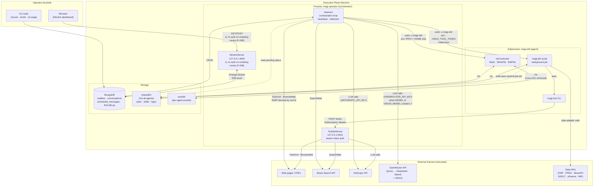
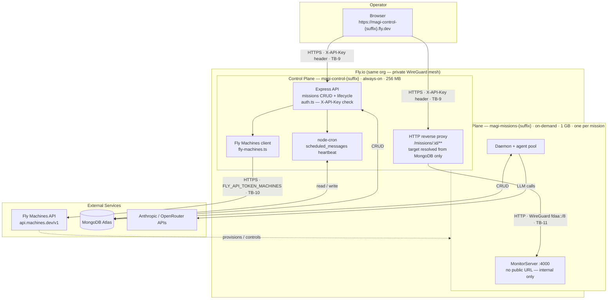

# MAGI V3 Threat Model

**Last updated:** Sprint 17 — Concurrent dispatcher landed (orchestrator.ts rewrite); no new trust boundaries; LLM08 updated to reflect concurrent overshoot amplification; F-017 opened for `verifyIsolation()` OPENROUTER_API_KEY gap; `isAgentPaused` hook noted as future Copilot authority surface (2026-05-12)
**Update cadence:** Update whenever a new trust boundary, external service, or privilege level is added.

---

## Actors

| Actor | Trust level | Capabilities |
|-------|-------------|--------------|
| Operator | **Fully trusted** | Posts messages, controls daemon, reads all mission state, runs CLI tools |
| Agent LLM output | **Conditionally trusted** | Calls tools within `AclPolicy`; confined to its `linuxUser` and `permittedPaths` |
| External web content | **Untrusted** | Injected into agent context via FetchUrl / BrowseWeb / SearchWeb / data adapters |
| Background job scripts | **Agent-trust** | Run as the agent's `linuxUser`; call ToolApiServer via short-lived bearer token |
| Other agents in mission | **Agent-trust** | Write to sharedDir; post mailbox messages; write mission skills |
| Fly.io Machines API | **External service** | Creates, starts, stops, destroys execution plane machines; does not access MongoDB or agent data |

---

## Data Flow Diagrams

### Execution Plane — Internal Architecture

### Cloud Deployment — Control Plane + Execution Plane

---

## Trust Boundaries

| Boundary | Crossing mechanism | Direction |
|----------|--------------------|-----------|
| **TB-1** | External internet ↔ Daemon | HTTP (FetchUrl, BrowseWeb, APIs, LLM calls) | Inbound: untrusted content; Outbound: requests including full conversation context to LLM providers |
| **TB-2** | Operator ↔ MonitorServer (local dev) | HTTP GET/POST on localhost:4000; no auth on mutating routes | Bidirectional |
| **TB-3** | Daemon (magi-operator) ↔ tool-executor (magi-wN) | `sudo -u magi-wN`, clean env | Outbound: commands; Inbound: stdout/stderr |
| **TB-4** | Daemon ↔ magi-job (magi-wN) | `sudo -u magi-wN`, +token +data keys | Outbound: script + env; Inbound: exit code |
| **TB-5** | magi-job (magi-wN) ↔ ToolApiServer (magi-operator) | HTTP + bearer token, loopback | Outbound: tool calls; Inbound: results |
| **TB-6** | Agent LLM ↔ tool execution | Tool call parsing + AclPolicy | Agent-controlled input to privileged operations |
| **TB-7** | Agents ↔ sharedDir | Filesystem (Linux ACLs on workdirs; sharedDir open to all agents) | All agents read/write shared surface |
| **TB-8** | External content ↔ agent context | FetchUrl/BrowseWeb result injected into LLM messages | Untrusted text into trusted reasoning |
| **TB-9** | Browser → Control plane HTTPS | HTTPS to `magi-control-{suffix}.fly.dev`; `X-API-Key` header auth | Bidirectional (REST API + SSE proxy) |
| **TB-10** | Control plane → Fly Machines API | HTTPS to `api.machines.dev/v1`; `FLY_API_TOKEN_MACHINES` bearer token | Outbound: machine lifecycle commands; Inbound: machine state |
| **TB-11** | Control plane proxy → Execution plane | HTTP over Fly WireGuard (`fdaa::/8`); no transport auth (network-level only) | Bidirectional (proxy + SSE stream) |

---

## Implementing Files by Boundary

### TB-1: External HTTP requests (FetchUrl, BrowseWeb, data adapters, LLM providers)
- `packages/agent-runtime-worker/src/tools/fetch-url.ts` — HTTP GET, HTML/PDF extraction, image download
- `packages/agent-runtime-worker/src/tools/browse-web.ts` — Playwright/Stagehand, SSRF check (initial nav only)
- `packages/agent-runtime-worker/src/tools/research.ts` — Research sub-loop; calls FetchUrl and SearchWeb
- `packages/agent-runtime-worker/src/tools/search-web.ts` — Brave Search API call
- `packages/agent-runtime-worker/src/ssrf.ts` — `isPrivateHost()` regex + post-DNS-resolution check
- `packages/agent-runtime-worker/src/models.ts` — `parseModel()`: routes `/`-delimited IDs to OpenRouter; bare IDs to Anthropic
- `packages/skills/data-factory/scripts/adapters/` — all 7 Python adapters (fmp, fred, yfinance, newsapi, gdelt, imf, worldbank)

### TB-2: MonitorServer (local dev — operator interface)
- `packages/agent-runtime-worker/src/monitor-server.ts` — HTTP server + SSE; binds `127.0.0.1:4000`; mutating routes lack auth; `GET /log` returns daemon log file tail

### TB-3: tool-executor subprocess (Bash, WriteFile, EditFile)
- `packages/agent-runtime-worker/src/tools.ts` — `checkPath()`, `AclPolicy`, `spawnSync`, clean child env, `verifyIsolation()`
- `packages/agent-runtime-worker/src/tool-executor.ts` — clean child entry point; reads stdin, dispatches, writes stdout

### TB-4: magi-job subprocess (background jobs + token injection)
- `packages/agent-runtime-worker/src/daemon.ts` — `runPendingJobs()`: token mint, `sudo` spawn, token revoke, spec validation
- `scripts/setup-dev.sh` — `magi-job` wrapper at `/usr/local/bin/magi-job`, sudoers NOPASSWD + `env_keep` rules

### TB-5: ToolApiServer — magi-job → daemon IPC
- `packages/agent-runtime-worker/src/tool-api-server.ts` — HTTP server `127.0.0.1:4001`; bearer token auth; tool dispatch
- `packages/agent-runtime-worker/src/cli-tool.ts` — `magi-tool` CLI (Node.js client)
- `packages/skills/run-background/scripts/magi_tool.py` — Python SDK client (stdlib only)

### TB-6: AclPolicy enforcement (LLM output → privileged operations)
- `packages/agent-runtime-worker/src/tools.ts` — `checkPath()`, `PolicyViolationError`, Bash/WriteFile/EditFile dispatch
- `packages/agent-runtime-worker/src/agent-runner.ts` — tool registration, `AclPolicy` construction, `researchAcl`
- `packages/agent-runtime-worker/src/loop.ts` — `maxTurns` cap, tool call dispatch
- `packages/agent-runtime-worker/src/orchestrator.ts` — `isAgentPaused?(agentId)` hook: future Copilot authority surface for pausing agents; currently no-op in production; Sprint 18 will wire the Copilot to this callback — the daemon must validate that pause requests originate from the Copilot agent only

### TB-7: sharedDir shared write surface
- `packages/agent-runtime-worker/src/workspace-manager.ts` — `setfacl` provisioning, dir creation, git init
- `packages/agent-runtime-worker/src/skills.ts` — `discoverSkills()`: SKILL.md frontmatter parsing, scope precedence
- `packages/agent-runtime-worker/src/daemon.ts` — scheduled message upsert (`spec.label` filter), job spec file reads

### TB-8: Untrusted content → agent context (prompt injection)
- `packages/agent-runtime-worker/src/tools/fetch-url.ts` — tool result (markdown) injected into LLM messages
- `packages/agent-runtime-worker/src/tools/browse-web.ts` — trust boundary markers wrapping Stagehand output
- `packages/agent-runtime-worker/src/prompt.ts` — `buildSystemPrompt()`: mental map + skills block → system prompt
- `packages/agent-runtime-worker/src/mental-map.ts` — `patchMentalMap()`: jsdom surgical patching of agent-written HTML
- `packages/agent-runtime-worker/src/reflection.ts` — cumulative summary injected as user message at session start
- `packages/agent-runtime-worker/src/mailbox.ts` — `listMessages` `$regex` search; message bodies formatted as user turns

### TB-9: Browser → Control plane (operator HTTPS)
- `packages/control-plane/src/auth.ts` — `X-API-Key` middleware; validates against `CONTROL_API_KEY` env var
- `packages/control-plane/src/missions.ts` — mission CRUD + lifecycle routes; input validation for `missionId`, `teamConfig`
- `packages/control-plane/src/index.ts` — Express app assembly; auth middleware applied to all routes

### TB-10: Control plane → Fly Machines API
- `packages/control-plane/src/fly-machines.ts` — Machines API client; reads `FLY_API_TOKEN_MACHINES` and `FLY_MISSIONS_APP_NAME` from env only; never user-supplied
- `packages/control-plane/src/scheduler.ts` — node-cron heartbeat; calls `resumeMission()` before delivering scheduled messages

### TB-11: Control plane proxy → Execution plane
- `packages/control-plane/src/proxy.ts` — resolves `privateIp` from MongoDB `missions` collection by `missionId`; validates machine state before forwarding
- `packages/control-plane/src/missions.ts` — stores `machineId` + `privateIp` at provision time

---

## STRIDE Threat Table

`✅` = mitigated; `⚠️` = open finding (see `findings.md`); `~` = partially mitigated; `A` = accepted.

### TB-1: External internet → FetchUrl / BrowseWeb

| Threat | Category | Status | Notes |
|--------|----------|--------|-------|
| SSRF via FetchUrl — fetch internal RFC-1918 or cloud-metadata services | I / E | ✅ F-001 | Fixed Sprint 13: `ssrf.ts` `isPrivateHost()` validates hostname + post-DNS-resolution IP |
| SSRF via BrowseWeb post-navigation redirect | I / E | ✅ F-002 | Fixed Sprint 16: `page.route("**/*", handler)` intercepts document/xhr/fetch requests during `agent().execute()`; known gap: new tab/popup pages do not inherit handler |
| DNS rebinding — IP changes between check and connect | I | ~ | Post-redirect check in `fetch-url.ts` partially mitigates; fully resolved when F-002 is fixed |
| Oversized response — OOM crash | D | ✅ | 50 MB response cap; Content-Length checked before read |
| Malicious content injected into agent context | T | ~ | Trust boundary markers on BrowseWeb; FetchUrl result injected as plain markdown (see TB-8) |
| Full conversation context sent to OpenRouter third-party proxy | I | ~ | OpenRouter has separate data-retention policy; `OPENROUTER_API_KEY` is daemon-only, never forwarded to subprocesses |
| `OPENROUTER_API_KEY` leaked into tool-executor child env | I | ✅ F-017 | Clean-env spawn is the primary control; `verifyIsolation()` now checks both `ANTHROPIC_API_KEY` and `OPENROUTER_API_KEY` |
| Fly.io WireGuard range (`fdaa::/8`) reachable via FetchUrl/BrowseWeb from execution plane | I / E | ~ | `ssrf.ts` blocks ULA prefix `fd[0-9a-f]{2}:` which covers `fdaa::`; verify after any `ssrf.ts` change |

### TB-2: Operator → MonitorServer (local dev)

| Threat | Category | Status | Notes |
|--------|----------|--------|-------|
| Unauthenticated `POST /stop`, `/send-message`, `/extend-budget` | S / E | ⚠️ F-008 | Binds to `127.0.0.1:4000` (localhost only); no auth on mutating routes |
| SSE stream exposes all mission data on localhost | I | ⚠️ F-009 | Any process on the machine can subscribe to the full agent activity stream |
| `GET /log` exposes daemon stdout/stderr (may include agent message excerpts, internal paths) | I | ~ | In local dev: localhost-only (same as F-009). In production: behind TB-9 `X-API-Key` via proxy; only authenticated operators can reach it |

### TB-3: Daemon → tool-executor (sudo boundary)

| Threat | Category | Status | Notes |
|--------|----------|--------|-------|
| API key leaks into child process env | I | ✅ | Child receives PATH + HOME + workspace context (SHARED_DIR, WORKDIR, AGENT_ID — not secrets); `verifyIsolation()` at startup confirms ANTHROPIC_API_KEY absent |
| Agent writes to another agent's workdir via Bash | T / E | ✅ | OS Linux ACLs (setfacl); covered by `acl.integration.test.ts` |
| Shell injection in setfacl call | E | ✅ | `execFileSync("setfacl", [...])` — no shell interpolation |

### TB-4: Daemon → magi-job (sudo boundary + token injection)

| Threat | Category | Status | Notes |
|--------|----------|--------|-------|
| linuxUser escalation via crafted job spec | E | ✅ | `linuxUser` removed from `JobSpec`; derived from `agentId` via team config (S12-A5) |
| scriptPath traversal via symlink | T / E | ✅ F-013 | Fixed Sprint 13: `realpathSync()` after `join()`; real path checked against `permittedPaths` |
| `MAGI_TOOL_TOKEN` not revoked if `spawn()` throws | I | ✅ F-014 | Fixed Sprint 13: token issued inside try; catch revokes immediately |
| `MAGI_TOOL_TOKEN` exposed in job log files | I | A | Token short-lived (revoked on exit); logs within sharedDir only (A-003) |
| No wall-clock timeout — hung job holds concurrency slot | D | ✅ F-006 | Fixed Sprint 13: `DEFAULT_JOB_TIMEOUT_MS = 30 min`; SIGKILL to process group on expiry |
| Orphaned `jobs/running/` on daemon restart | D | ✅ F-010 | Fixed Sprint 13: `recoverOrphanedJobs()` at startup moves running → pending |

### TB-5: magi-job → ToolApiServer (bearer token)

| Threat | Category | Status | Notes |
|--------|----------|--------|-------|
| Token theft — used by another process on same machine | S | ~ | Short-lived; bound to agent's AclPolicy; cannot escalate beyond it |
| Token exceeds agent's AclPolicy | E | ✅ | AclPolicy enforced by ToolApiServer on every call |
| Client timeout outlasts server timeout — concurrency slot held | D | ✅ F-015 | Fixed Sprint 13: Python SDK timeout 135 s (server 120 s + 15 s buffer) |

### TB-6: Agent LLM → tool execution (AclPolicy boundary)

| Threat | Category | Status | Notes |
|--------|----------|--------|-------|
| Symlink traversal in WriteFile/EditFile | T / E | ✅ F-003 | Fixed Sprint 13: `realpathSync()` after `resolve()`; both resolved and real paths checked |
| `file://` LFI via FetchUrl | I | ✅ | `file://` protocol rejected at URL parse (S4-C1) |
| Bash timeout bypass — pass large timeout value | D | ✅ | Capped at 600 s (S4-M3) |
| Bash background processes escape spawnSync timeout | D | ✅ F-011 | Fixed Sprint 13: `execa` + `detached: true`; SIGKILL to process group |
| PostMessage to arbitrary recipient | T | ✅ | Recipient validated against team roster (S4-M2) |

### TB-7: Agents ↔ sharedDir (shared write surface)

| Threat | Category | Status | Notes |
|--------|----------|--------|-------|
| Agent overwrites another agent's sharedDir output | T | A | Intentional design (collaboration); workdir ACL isolation is the backstop (A-001) |
| Adversarial SKILL.md in mission/ tier (prompt injection via skill description) | T | ~ | `description` injected into all agents' system prompts; no sanitisation; symlinks excluded in `discoverSkills()` |
| Agent writes crafted schedule label — MongoDB operator injection | T | ✅ F-005 | Fixed Sprint 13: `typeof spec.label !== 'string'` guard; invalid specs skipped |

### TB-8: External content → agent context (prompt injection)

| Threat | Category | Status | Notes |
|--------|----------|--------|-------|
| Injected web content overrides agent instructions | T | ~ | BrowseWeb has trust boundary markers; FetchUrl result injected as plain markdown |
| Compromised agent writes adversarial HTML to mental map | T | ~ | `patchMentalMap` uses jsdom surgical patching; arbitrary section insertion possible via id-bearing elements |
| MongoDB `$regex` ReDoS via LLM-generated search string | D | ✅ F-004 | Fixed Sprint 13: metacharacters escaped; search string capped at 200 chars |

### TB-9: Browser → Control plane HTTPS

| Threat | Category | Status | Notes |
|--------|----------|--------|-------|
| API key brute force or theft → unauthorized mission control | S | ~ | Mitigated by strong 32-byte random key and HTTPS; no rate limiting on auth endpoint → ⚠️ F-016 |
| Malicious `missionId`/`teamConfig` parameters → path traversal | T | ✅ | `missionId` sanitised before use as volume/machine name; `teamConfig` resolved against fixed image paths only |
| API key intercepted in transit | I | ✅ | Fly.io enforces HTTPS on all `*.fly.dev` domains; HTTP redirects to HTTPS |

### TB-10: Control plane → Fly Machines API

| Threat | Category | Status | Notes |
|--------|----------|--------|-------|
| `FLY_API_TOKEN_MACHINES` theft → unauthorized machine creation/destruction | S | ~ | Token is deploy-scoped to one Fly app only; stored as Fly secret, not in code or image |
| Leaked token used to inject malicious env vars into new machines | T | ~ | App-scoped token cannot affect other Fly apps or Atlas; env vars at create time controlled by `fly-machines.ts` |
| `FLY_API_TOKEN_MACHINES` forwarded to execution plane machines | I | ✅ | `fly-machines.ts` explicitly does NOT include this token in machine `env` |
| App name or machine ID from user input → Machines API targeted to wrong app | T | ✅ | App name from `FLY_MISSIONS_APP_NAME` env var only; machine IDs from MongoDB `missions` collection only |

### TB-11: Control plane proxy → Execution plane

| Threat | Category | Status | Notes |
|--------|----------|--------|-------|
| Proxy target from user input → SSRF to internal Fly services | T / E | ✅ | `proxy.ts` resolves `privateIp` from MongoDB by `missionId`; never interpolates request parameters |
| Proxy forwards to stopped machine | D | ✅ | `proxy.ts` validates machine state == "running" before forwarding; returns 404 otherwise |
| Monitor server unauthenticated mutating routes exposed via proxy | S / E | ⚠️ F-008 | Operator `CONTROL_API_KEY` is the only auth layer; monitor's own mutating endpoints have no token check |
| WireGuard traffic interceptable within Fly org | I | ~ | WireGuard encrypts in transit; peers in same org share the mesh — acceptable for single-org deployment |

---

## OWASP LLM Top 10 Threat Table

`✅` = mitigated; `⚠️` = open finding; `~` = partially mitigated; `A` = accepted.

| OWASP ID | Name | MAGI relevance | Status | Notes |
|----------|------|----------------|--------|-------|
| **LLM01** | Prompt Injection | Untrusted content (web pages, news articles, mailbox bodies, SKILL.md descriptions) enters LLM context and may override agent instructions | ~ | BrowseWeb wraps output in trust boundary markers; FetchUrl and SearchWeb injected as plain markdown. Role-focused system prompts are the only defence once content is in context. |
| **LLM02** | Insecure Output Handling | LLM output drives: Bash commands, WriteFile paths, JobSpec `scriptPath`, schedule labels, PostMessage recipients | ~ | AclPolicy constrains file paths. `scriptPath` validated against `permittedPaths`. Schedule label type guard added (F-005). PostMessage recipient validated against team roster. Bash unconstrained within `linuxUser` — OS ACLs are the backstop. |
| **LLM06** | Sensitive Information Disclosure | System prompt contains role, mental map (may include financial observations), skills block. Full conversation transmitted to OpenRouter when non-Anthropic models are used. | ~ | No credentials in system prompt. **OpenRouter risk:** financial mission context sent to third-party proxy with separate data-retention policy when `MODEL` or `VISION_MODEL` contains `/`. |
| **LLM07** | System Prompt Leakage | Injected instruction asks agent to include system prompt content in a FetchUrl URL, leaking role constraints and mental map. | ~ | PostMessage recipients restricted to team roster (no external exfiltration via mailbox). FetchUrl to attacker-controlled URL could exfiltrate if agent is tricked. No hard mitigation beyond prompt design. |
| **LLM08** | Excessive Agency | Agents have broad capabilities: Bash (arbitrary shell), WriteFile, EditFile, PostMessage, Research, FetchUrl, BrowseWeb, scheduled jobs. Concurrent execution (Sprint 17) amplifies cost exposure. | ~ | OS ACLs limit blast radius to agent's workdir + sharedDir. `MAX_COST_USD` caps spending, but `waitForBudget()` gates each *dispatch* — with N agents running concurrently, overshoot can be N × (one LLM call cost) before the pause fires. No per-session job-submission count limit. `RESEARCH_MAX_TURNS=10` limits Research sub-loop depth. |
| **LLM09** | Overreliance | Agents read data factory outputs without independently verifying freshness. Stale/corrupted data leads to incorrect recommendations. | ~ | `catalog.json` tracks `fetched_at` and `status`. Consumer SKILL.md instructs checking status before use. No enforcement — agents can ignore stale flags. |
