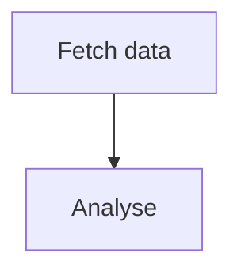

# PostMessage Conventions

## Subject line format

`[intent] Brief description of the ask or result`

**Intent tags:**
- `[task]` — requesting another agent perform a task
- `[result]` — reporting the outcome of a completed task
- `[question]` — asking for clarification or data
- `[alert]` — urgent issue requiring immediate attention
- `[fyi]` — informational, no action required

**Examples:**
- `[task] Analyse Q4 earnings PDF and report key figures`
- `[result] Report complete — saved at /missions/x/shared/report.md`
- `[alert] Source feed unreachable since 06:15 UTC`

## Message body

For **task requests**, include:
- Clear success criteria ("I need you to return X")
- Relevant file paths or artifact references
- Deadline or priority if time-sensitive

For **result submissions**, include:
- A one-line summary of the outcome
- Absolute path(s) of any output files written
- Any caveats or follow-up actions needed

## Artifact references

When referring to a file you have written:
- Use the absolute path: `/missions/{id}/shared/report.md`
- State the commit SHA if committed: `(commit abc1234)`

## Formatted output

The body renders as markdown in the operator's dashboard and in every
teammate's inbox — plain text always works, but the following also render:

**Basic markdown:** `# `/`## `/`### ` headers, `**bold**`, `*italic*`,
`` `inline code` ``, fenced ` ```code``` ` blocks, `[label](https://url)`
links (`http(s)`/`mailto` only — any other scheme is left as plain text),
`- ` bullet lists, and GitHub-style `| a | b |` tables.

**Diagrams — mermaid:**
````

````

**Math — KaTeX block math only:**
```
$$
\text{Sharpe} = \frac{R_p - R_f}{\sigma_p}
$$
```
Put `$$` on its own line before and after the expression. Inline `$...$`
math is **not** supported — this app's messages are full of dollar
amounts ("$5.00 per share"), which a naive inline-math parser would
constantly misinterpret. Don't use single-`$` math; it will render as
literal text.

**Images:** to show a chart, screenshot, or any other image you've
produced (e.g. a Bash/matplotlib script that wrote a PNG), reference it
with standard markdown image syntax:

```

```

Requirements:
- The image must already be written to **your shared workspace**
  (`$SHARED_DIR`, the same tree the Files panel and your teammates can
  see) — a path in your own private workdir won't resolve.
- The path is relative to `$SHARED_DIR`, same as any other file
  reference in this skill.
- Only workspace-relative paths render inline. An external `http(s)` URL
  is deliberately left as plain text, not rendered — the dashboard
  doesn't fetch arbitrary third-party images on your behalf.

## Priority

There is no priority/urgency field on `PostMessage` — every message is
delivered to the recipient's inbox the same way. If something is
genuinely urgent, say so in the subject line (`[alert] ...`) rather than
relying on a delivery-priority mechanism that doesn't exist.
